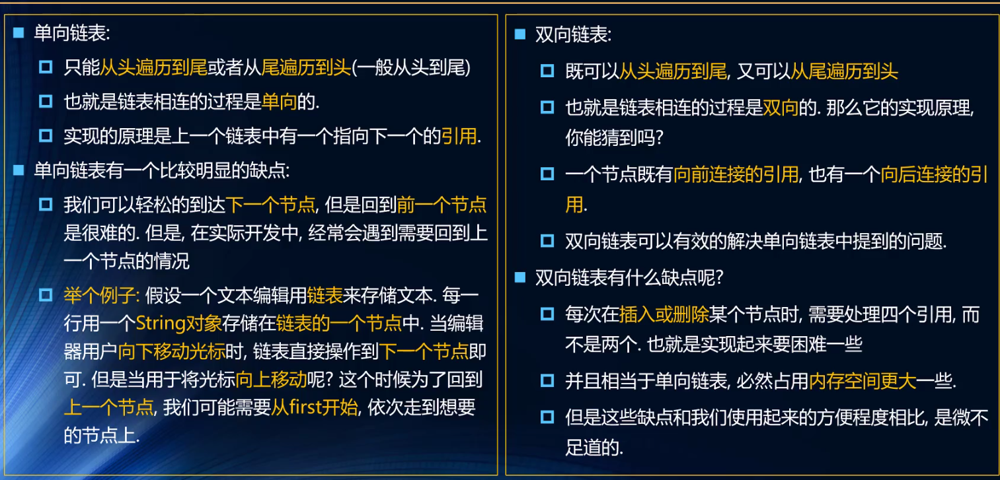

# 数据结构与算法

## 1. 栈

```js
// 栈类
class Stack {
  constructor() {
    this.items = [];
  }
  // 方法
  // 1.向栈中添加元素
  push(element) {
    this.items.push(element);
  }
  // 2.向栈中移除元素
  pop() {
    return this.items.pop();
  }
  // 3.查看栈顶元素
  peek() {
    return this.items[this.items.length - 1];
  }
  // 4.检查栈是否为空
  isEmpty() {
    return this.items.length === 0;
  }
  // 5.查看栈的大小
  size() {
    return this.items.length;
  }
  // 6.清空栈元素
  clear() {
    this.items = [];
  }
  // 7.toString 方法
  toString() {
    return this.items.join("");
  }
}
```


## 2. 队列

```js
// 队列类
class Queue {
  constructor() {
    this.items = [];
  }
  // 方法
  // 1.向队尾添加元素
  enqueue(element) {
    this.items.push(element)
  }
  // 2.从队前删除元素
  dequeue() {
    return this.items.shift() //数组删除前面的元素效率不高
  }
  // 3.查看队前元素
  front() {
    return this.items[0]
  }
  // 4.查看队列是否为空
  isEmpty() {
    return this.items.length === 0
  }
  // 5.查看元素个数
  size() {
    return this.items.length
  }
  // 6.toString方法
  toString() {
    return this.items.join('')
  }
}
```

## 3. 链表

### ① 单向链表

```js
 // 节点类
 class Node {
   constructor(data) {
     this.data = data
     this.next = null
   }
 }

 // 链表类
 class LinkedList {
   constructor() {
     this.head = null
     this.length = 0
   }

   // 1.向链表末尾添加元素
   append(data) {
     // a.创建一个新的节点
     let newNode = new Node(data)
     // b.先判断是否为第一个节点，并找到最后一个元素,将元素添加到最后
     if (this.length == 0) {
       this.head = newNode
     } else {
       let current = this.head
       while (current.next) {
         current = current.next
       }
       current.next = newNode
     }
     // c.长度+1
     this.length++
   }

   // 2.toString方法,方便代码测试
   toString() {
     let listString = ""
     let current = this.head
     while (current) {
       listString += current.data + " "
       current = current.next
     }
     return listString
   }

   // 3.向链表插入元素
   insert(position, data) {
     // a.先判断是否越界
     if (position < 0 || position > this.length) return false
     // b.创建新节点
     let newNode = new Node(data)
     // c.再判断是否为第一个元素,并插入元素
     if (position == 0) {
       newNode.next = this.head
       this.head = newNode
     } else {
       let current = this.head
       // 找到插入位置的前一个元素
       for (let i = 0; i < position - 1; i++) {
         current = current.next
       }
       newNode.next = current.next
       current.next = newNode
     }
     //d.length + 1
     this.length++
   }

   // 4.获取对应位置的元素
   get(position) {
     // a.先判断是否越界
     if (position < 0 || position >= this.length) return null
     // b.查找元素
     let current = this.head
     for (let i = 0; i < position; i++) {
       current = current.next
     }
     return current.data
   }

   // 5.获取元素在列表中的索引
   indexOf(data) {
     let current = this.head
     let index = []
     for (let i = 0; i < this.length; i++) {
       if (current.data == data) {
         index.push(i)
       }
       current = current.next
     }
     // 若不存在返回-1
     return index == [] ? -1 : index
   }

   // 6.修改某个位置的元素
   update(position, data) {
     // a.先判断是否越界
     if (position < 0 || position >= this.length) return false
     // b.查找元素，并修改
     let current = this.head
     for (let i = 0; i < position; i++) {
       current = current.next
     }
     current.data = data
   }

   // 7.从列表中删除特定位置的一项
   removeAt(position) {
     // a.先判断是否越界
     if (position < 0 || position >= this.length) return false
     // b.查找元素，并删除
     let dele = ''
     if (position == 0) {
       this.head = this.head.next
     } else {
       // 找到插入位置的前一个元素
       let current = this.head
       for (let i = 0; i < position - 1; i++) {
         current = current.next
       }
       dele = current.next.data
       current.next = current.next.next
     }
     // c.length - 1
     this.length--
     return dele
   }

   // 8.从列表中删除特定元素的项
   remove(data) {
     // a.先获取元素所在位置,并反转数组
     let position = this.indexOf(data).reverse()
     // b.再删除位置对应的元素，从后往前删除
     for (let value of position) {
       this.removeAt(value)
     }
   }

   // 9.判断链表是否为空
   isEmpty() {
     return this.length == 0
   }

   // 10.获取链表元素个数
   size() {
     return this.length
   }
 }
```

### ② 双向链表

```js
    // 节点类
    class DoublyNode {
      constructor(data) {
        this.data = data
        this.next = null
        this.prev = null
      }
    }

    // 双向链表
    class DoublyLinkedList {
      constructor() {
        this.head = null
        this.tail = null
        this.length = 0
      }

      // 1.向链表末尾添加元素
      append(element) {
        // a.创建一个新的节点
        let newNode = new DoublyNode(element)
        // b.先判断是否为第一个节点，并找到最后一个元素,将元素添加到最后
        if (this.length == 0) {
          this.head = newNode
          this.tail = newNode
        } else {
          newNode.prev = this.tail
          this.tail.next = newNode
          this.tail = newNode
        }
        // c.length+1
        this.length++
      }

      // 2.链表转换为字符串
      // 2.1.toString方法
      toString() {
        let listString = ""
        let current = this.head
        while (current) {
          listString += current.data + " "
          current = current.next
        }
        return listString
      }
      // 2.2.forwardString方法,正向遍历
      forwardString() {
        return this.toString()
      }
      // 2.3.backwardString方法，反向遍历
      backwardString() {
        let listString = ""
        let current = this.tail
        while (current) {
          listString += current.data + " "
          current = current.prev
        }
        return listString
      }

      // 3.向链表插入元素
      insert(position, data) {
        // a.先判断是否越界
        if (position < 0 || position > this.length) return false
        // b.创建新节点
        let newNode = new DoublyNode(data)
        // c.判断是否为第一个节点,并插入元素
        if (position == 0) {
          // 判断是否为空链表
          if (this.length == 0) {
            this.head = newNode
            this.tail = newNode
          } else {
            this.head.prev = newNode
            newNode.next = this.head
            this.head = newNode
          }
        } else if (position == this.length) { // 判断是否在最后一个节点后面添加
          newNode.prev = this.tail
          this.tail.next = newNode
          this.tail = newNode
        } else {
          let current = this.head
          // 找到插入位置的前一个元素
          for (let i = 0; i < position - 1; i++) {
            current = current.next
          }
          // 修改指针
          current.next.prev = newNode
          newNode.next = current.next
          newNode.prev = current
          current.next = newNode
        }
        //d.length + 1 
        this.length++
      }

      // 4.获取对应位置的元素
      get(position) {
        // a.先判断是否越界
        if (position < 0 || position >= this.length) return null
        // b.查找元素,判断元素是否在一半之前，提高查找速度
        let current = null
        if (position < this.length / 2) {
          current = this.head
          for (let i = 0; i < position; i++) {
            current = current.next
          }
        } else {
          current = this.tail
          for (let i = 0; i < this.length - position - 1; i++) {
            current = current.prev
          }
        }
        return current.data
      }

      // 5.获取元素在列表中的索引
      indexOf(data) {
        let current = this.head
        let index = []
        for (let i = 0; i < this.length; i++) {
          if (current.data == data) {
            index.push(i)
          }
          current = current.next
        }
        // 若不存在返回-1
        return index == [] ? -1 : index
      }

      // 6.修改某个位置的元素
      update(position, data) {
        // a.先判断是否越界
        if (position < 0 || position >= this.length) return false
        // b.查找元素,判断元素是否在一半之前，提高查找速度
        if (position < this.length / 2) {
          let current = this.head
          for (let i = 0; i < position; i++) {
            current = current.next
          }
          // c.修改节点的data
          current.data = data
        } else {
          let current = this.tail
          for (let i = 0; i <
            this.length - position - 1; i++) {
            current = current.prev
          }
          // c.修改节点的data
          current.data = data
        }
      }

      // 7.从列表中删除特定位置的一项
      removeAt(position) {
        // a.先判断是否越界
        if (position < 0 || position >= this.length) return false
        // b.判断是否为第一个节点,并删除元素
        let dele = ''
        if (position == 0) {
          dele = this.head.data
          // 判断链表是否只有一个节点
          if (this.length == 1) {
            this.head = null
            this.tail = null
          } else {
            this.head.next.prev = null
            this.head = this.head.next
          }
        } else if (position == this.length - 1) { // 判断是否为最后一个节点
          dele = this.tail.data
          this.tail.prev.next = null
          this.tail = this.tail.prev
        } else {
          // 找到删除位置的节点
          let current = null
          if (position < this.length / 2) {
            current = this.head
            for (let i = 0; i < position; i++) {
              current = current.next
            }
          } else {
            current = this.tail
            for (let i = 0; i < this.length - position - 1; i++) {
              current = current.prev
            }
          }
          dele = current.data
          // 修改指针 
          current.prev.next = current.next
          current.next.prev = current.prev
        }
        // c.length - 1 
        this.length--
        return dele
      }

      // 8.从列表中删除特定元素的项
      remove(data) {
        // a.先获取元素所在位置,并反转数组
        let position = this.indexOf(data).reverse()
        // b.再删除位置对应的元素，从后往前删除
        for (let value of position) {
          this.removeAt(value)
        }
      }

      // 9.判断链表是否为空
      isEmpty() {
        return this.length == 0
      }

      // 10.获取链表元素个数
      size() {
        return this.length
      }

      // 11.获取链表的第一个元素
      getHead() {
        return this.head.data
      }

      // 10.获取链表的最后一个元素
      getTail() {
        return this.tail.data
      }
    }
```

### ③ 单向链表和双向链表的区别：




## 4. 集合

```js
class Set {
  constructor() {
    this.items = {}
  }

  // 1.向集合添加一个新的项
  add(value) {
    // 先判断集合中是否有该值
    if (this.has(value)) return false
    // 不存在则添加
    this.items[value] = value
    return true
  }

  // 2.从集合中移除一个值
  remove(value) {
    // 先判断集合中是否有该值
    if (!this.has(value)) return false
    // 存在则删除
    delete this.items[value]
    return true
  }

  // 3.判断集合中是否有某一个值
  has(value) {
    // 使用对象的 hasOwnProperty 方法
    return this.items.hasOwnProperty(value)
  }

  // 4.移除集合中所有项
  clear() {
    this.items = {}
  }

  // 5.获取集合中元素数量
  size() {
    return Object.keys(this.items).length
  }

  // 6.返回包含集合中所有值的数组
  values() {
    return Object.keys(this.items)
  }
}
```


## 5. 字典

```js
class Dictionary {
      constructor() {
        this.items = {}
      }

      // 1.在字典中添加键值对
      set(key, value) {
        this.items[key] = value
      }

      // 2.从字典中移除元素
      remove(key) {
        // 先判断是否有key
        if (!this.has(key)) return false
        // 存在则删除
        delete this.items[key]
        return true
      }

      // 3.判断集合中是否有某一个值
      has(key) {
        // 使用对象的 hasOwnProperty 方法
        return this.items.hasOwnProperty(key)
      }

      // 4.根据key去获取对应value
      get(key) {
        return this.has(key) ? this.items[key] : undefined
      }

      // 5.获取所有的keys
      keys() {
        return Object.keys(this.items)
      }

      // 6.获取所有的value
      values() {
        return Object.keys(this.items)
      }

      // 7.获取字典中元素数量
      size() {
        return Object.keys(this.items).length
      }

      // 8.移除字典中所有项
      clear() {
        this.items = {}
      }
    }

```


## 6. 哈希表

```js
 // 哈希表
 class HashTable {
   constructor() {
     this.storage = [] // 哈希表存储数据的变量
     this.count = 0 // 当前存放的元素个数
     this.limit = 7 // 哈希表长度（初始设为质数 7）|| 容量是质数有利于数据的均匀分布
     // 装填因子(已有个数/总个数)
     this.loadFactor = 0.75;
     this.minLoadFactor = 0.25;
   }

   // 哈希函数
   hashFn(string, limit) {
     // 随便采用一个质数
     const PRIME = 31
     // a.定义hashCode
     let hashCode = 0
     // b.使用霍纳法则（秦九韶算法），计算 hashCode 的值
     for (let item of string) {
       hashCode = PRIME * hashCode + item.charCodeAt() //使用charCodeAt获取字符对应ASCII值
     }
     // c.对 hashCode 取余，并返回
     return hashCode % limit
   }

   // 判断是否为质数的函数
   isPrime(number) {
     if (number <= 1 || number === 4) return false;
     let temp = Math.ceil(Math.sqrt(number));
     for (let i = 2; i <= temp; i++) {
       if (number % i === 0) {
         return false;
       }
     }
     return true;
   }

   // 获取最临近质数的函数
   getPrime(number) {
     while (!this.isPrime(number)) {
       number++;
     }
     return number;
   }

   // 1.往哈希表里添加数据
   put(key, value) {
     // a.根据 key 获取要映射到 storage 里面的 index（通过哈希函数获取）
     const index = this.hashFn(key, this.limit)
     // b.根据 index 取出对应的 bucket (每个index对应的数据存放在一个桶中)
     let bucket = this.storage[index]
     // c.判断是否存在 bucket
     if (bucket === undefined) {
       bucket = [] // 不存在则创建
       this.storage[index] = bucket
     }
     // d.判断是插入数据操作还是修改数据操作(是否已经存在当前的key)
     let overide = false
     for (let i = 0; i < bucket.length; i++) {
       let tuple = bucket[i] // tuple 的格式：[key, value]
       if (tuple[0] === key) { // 如果 key 相等，则修改数据 
         tuple[1] = value
         overide = true
         return
       }
     }
     // 若不存在则往bucket新增数据
     if (!overide) {
       bucket.push([key, value]) // bucket 存储元组 tuple，格式为 [key, value]
       this.count++
       // e、判断哈希表是否要扩容，若装填因子> 0.75，则扩容
       if (this.count / this.limit > this.loadFactor) {
         this.resize(this.getPrime(this.limit * 2))
       }
     }
   }

   // 2.根据key查找元素value
   get(key) {
     // a.根据key获取index，再取出bucket
     const index = this.hashFn(key, this.limit)
     const bucket = this.storage[index]
     // b.判断是否存在，存在则取出
     if (bucket === undefined) {
       return null
     }
     for (const tuple of bucket) {
       if (tuple[0] === key) {
         return tuple[1]
       }
     }
     return null
   }

   // 3.根据key删除元素
   remove(key) {
     // a.根据key获取index，再取出bucket
     const index = hashFn(key, this.limit);
     const bucket = this.storage[index];
     // b.找到并删除元素
     if (bucket === undefined) {
       return null;
     }
     // 遍历 bucket，找到对应位置的 tuple，将其删除
     for (let i = 0, len = bucket.length; i < len; i++) {
       const tuple = bucket[i];
       if (tuple[0] === key) {
         bucket.splice(i, 1); // 删除对应位置的数组项 
         this.count--;
         // c.根据装填因子的大小，判断是否要进行哈希表压缩 
         if (this.limit > 7 && this.count / this.limit < this.minLoadFactor) {
           this.resize(this.getPrime(Math.floor(this.limit / 2)));
         }
         return tuple;
       }
     }
   }

   // 4.判断是否为空
   isEmpty() {
     return this.count === 0;
   }

   // 5.获取哈希表大小
   size() {
     return this.count;
   }

   // 6.修改哈希表大小，扩容或压缩
   resize(newLimit) {
     // a.保存旧的 storage
     const oldStorage = this.storage;
     // b.重置所有属性
     this.storage = [];
     this.count = 0;
     this.limit = newLimit;
     // c.遍历 oldStorage，取出所有数据，调用put方法 添加到新的 storage
     for (const bucket of oldStorage) {
       if (bucket) {
         for (const tuple of bucket) {
           this.put(tuple[0], tuple[1]);
         }
       }
     }
   }
 }
```

### 哈希表的优缺点

**优点：**

+ 哈希表通常是基于数组进行实现的,但是相对于数组，它也很多的优势:它可以提供非常快速的插入-删除-查找操作
+ 无论多少数据插入和删除值需要接近常量的时间:即O(1)的时间级.实际上，只需要几个机器指令即可完成
+ 哈希表的速度比树还要快,基本可以瞬间查找到想要的元素
+ 哈希表相对于树来说编码要容易很多.

**缺点**：

+ 哈希表中的数据是没有顺序的,所以不能以一种固定的方式(比如从小到大)来遍历其中的元素.
+ 通常情况下，哈希表中的key是不允许重复的, 不能放置相同的key,用于保存不同的元素.
+ 存在空间的浪费.

## 7. 树

```js
 // 节点类
 class Node {
   constructor(key) {
     this.key = key
     this.left = null
     this.right = null
   }
 }

 // 二叉搜索树
 class BinarySearchTree {
   constructor() {
     this.root = null // 指向根节点
   }

   // 1.插入数据
   insert(key) {
     let newNode = new Node(key)
     if (this.root === null) {
       this.root = newNode
     } else {
       this.insertNode(this.root, newNode)
     }
   }
   // 递归查找插入节点
   insertNode(root, newNode) {
     // 小则往左边查找插入
     if (newNode.key < root.key) {
       if (root.left === null) {
         root.left = newNode;
       } else {
         this.insertNode(root.left, newNode);
       }
     } else if (newNode.key > root.key) { // 大则往右边查找插入
       if (root.right === null) {
         root.right = newNode;
       } else {
         this.insertNode(root.right, newNode);
       }
     } else {
       return false
     }
   }

   // 2.遍历二叉树
   // 2.1.先序遍历 (根 -> 左 -> 右)
   preorderTraverse() {
     let result = [];
     this.preorderTraverseNode(this.root, result);
     return result;
   }
   // 递归遍历
   preorderTraverseNode(node, result) {
     if (node === null) return result;
     result.push(node.key);
     this.preorderTraverseNode(node.left, result);
     this.preorderTraverseNode(node.right, result);
   }
   // 2.2.中序遍历（左 -> 根 -> 右）
   inorderTraverse() {
     const result = [];
     this.inorderTraverseNode(this.root, result);
     return result;
   }
   // 递归遍历
   inorderTraverseNode(node, result) {
     if (node === null) return result;
     this.inorderTraverseNode(node.left, result);
     result.push(node.key);
     this.inorderTraverseNode(node.right, result);
   }
   // 2.3.后序遍历（左 -> 右 -> 根）
   postorderTraverse() {
     const result = [];
     this.postorderTraverseNode(this.root, result);
     return result;
   }
   // 递归遍历
   postorderTraverseNode(node, result) {
     if (node === null) return result;
     this.postorderTraverseNode(node.left, result);
     this.postorderTraverseNode(node.right, result);
     result.push(node.key);
   }

   // 3.获取最大最小值
   // 3.1.获取最小值,找最左边子节点
   min() {
     let node = this.root
     if (node.left !== null) {
       node = node.left
     }
     return node.key
   }
   //3.2.获取最大值,找最右边子节点
   max() {
     let node = this.root
     if (node.right !== null) {
       node = node.right
     }
     return node.key
   }

   // 4.搜索节点
   search(key) {
     return this.searchNode(this.root, key);
   }
   // 递归实现搜索
   searchNode(node, key) {
     if (node === null) return false
     if (key < node.key) {
       return this.searchNode(node.left, key)
     } else if (key > node.key) {
       return this.searchNode(node.right, key)
     } else {
       return true
     }
   }

   // 5.删除节点
   remove(key) {
     // a.定义变量记录状态
     let currentNode = this.root;
     let parentNode = null; // 父节点
     let isLeftChild = true; // 是否为左节点
     // b.查找需要删除的节点,并记录parentNode和isLeftChild
     while (key !== currentNode.key) {
       parentNode = currentNode
       if (key < currentNode.key) {
         isLeftChild = true
         currentNode = currentNode.left
       } else {
         isLeftChild = false
         currentNode = currentNode.right
       }
       if (currentNode === null) {
         return false; // 若未找到，返回false
       }
     }
     // c.删除节点，分为三种情况
     // (1) 删除的节点是叶子节点
     if (currentNode.left === null && currentNode.right === null) {
       if (currentNode === this.root) {
         // 先考虑是否未树根
         this.root = null;
       } else if (isLeftChild) {
         parentNode.left = null;
       } else {
         parentNode.right = null;
       }
     }
     // (2) 删除的节点只有一个子节点
     else if (currentNode.right === null) { // 只有左节点
       if (currentNode === this.root) {
         // 先考虑是否未树根
         this.root = currentNode.left;
       } else if (isLeftChild) {
         parentNode.left = currentNode.left;
       } else {
         parentNode.right = currentNode.left;
       }
     } else if (currentNode.left === null) { // 只有右节点
       if (currentNode === this.root) {
         // 先考虑是否未树根
         this.root = currentNode.right;
       } else if (isLeftChild) {
         parentNode.left = currentNode.right;
       } else {
         parentNode.right = currentNode.right;
       }
     }
     // (3) 删除的节点有两个子节点
     else {
       // 找到左边的最大节点(前驱)，或右边的最小节点(后继)，替换至删除节点的位置
       // a.找到后继节点
       let successor = this.getSuccessor(currentNode);
       // b.判断是否为根节点
       if (currentNode === this.root) {
         this.root = successor;
       } else if (isLeftChild) {
         parentNode.left = successor;
       } else {
         parentNode.right = successor;
       }
       // c.将后继的左节点改为被删除的左节点
       successor.left = currentNode.left;
     }
     return true
   }
   // 获取后继节点的函数(右边最小节点)
   getSuccessor(delNode) {
     // 定义变量，存储临时变量
     let successorParent = delNode;
     let successor = delNode;
     let current = delNode.right;
     // 找到右节点下最小的子节点(往左节点寻找)
     while (current !== null) {
       successorParent = successor;
       successor = current;
       current = current.left;
     }
     // 判断寻找到的后继节点是否就是要删除节点的 right 
     if (successor !== delNode.right) {
       successorParent.left = successor.right;
       successor.right = delNode.right;
     }
     return successor;
   }
 }
```


## 8. 图

```js
class Graph {
  constructor(isDirected = false) {
    this.isDirected = isDirected // 是否为单项图
    this.vertices = [] // 顶点
    this.edges = new Dictionary() // 边
  }

  // 1.添加顶点
  addVertex(v) {
    if (!this.vertices.includes(v)) {
      this.vertices.push(v)
      this.edges.set(v, [])
    }
  }

  // 2.添加边
  addEdge(v1, v2) {
    // 若不存在v1、v2，先添加顶点
    if (!this.edges.get(v1)) this.addVertex(v1)
    if (!this.edges.get(v2)) this.addVertex(v2)
    this.edges.get(v1).push(v2)
    if (!this.isDirected) this.edges.get(v2).push(v1)
  }

  // 3.toString方法，便于调试
  toString() {
    let resultStr = ""
    for (let i = 0; i < this.vertices.length; i++) {
      resultStr += this.vertices[i] + "->"
      let adj = this.edges.get(this.vertices[i])
      for (let j = 0; j < adj.length; j++) {
        resultStr += adj[j] + " "
      }
      resultStr += "\n"
    }
    return resultStr
  }

  // 4.图的遍历(需要指定第一个被访问的节点)
  // 初始化状态颜色
  initializeColor() {
    let colors = []
    for (i of this.vertices) {
      colors[i] = 'white'
    }
    return colors
  }
  // 4.1.广度优先搜索(BFS)
  bfs(init_v, handler) {
    // a.初始化颜色 (白：未访问；灰：已访问、未探索；黑：已访问、已探索)
    let colors = this.initializeColor()
    // b.创建队列,并将顶点加入到队列中
    let queue = new Queue()
    queue.enqueue(init_v)
    // c.循环从队列中取出元素
    while (!queue.isEmpty()) {
      let v = queue.dequeue()
      let vList = this.edges.get(v) // v相邻的顶点
      colors[v] = 'gray'
      // 遍历相邻顶点，并加入队列当中
      for (i of vList) {
        if (colors[i] == 'white') { // 白色才加入队列
          colors[i] = 'gray'
          queue.enqueue(i)
        }
      }
      // 探索顶点,并设置为黑色
      handler(v)
      colors[v] = 'black'
    }
  }
  // 4.2.深度优先搜索(DFS)
  dfs(init_v, handler) {
    // a.初始化颜色
    let colors = this.initializeColor()
    // b.递归依次访问
    this.dfsVisit(init_v, colors, handler)
  }
  // 递归访问顶点
  dfsVisit(v, colors, handler) {
    // 将v设置为灰色
    colors[v] = 'gray'
    // 取出v相邻的顶点
    let vList = this.edges.get(v)
    // 探索顶点,并设置为黑色
    handler(v)
    colors[v] = 'black'
    // 访问v相邻顶点
    for (i of vList) {
      if (colors[i] == 'white') { // 白色才访问
        this.dfsVisit(i, colors, handler)
      }
    }
  }
}
```


## 9. 排序算法

### ① 插入排序

```js
// 列表类
class ArrayList {
  constructor() {
    this.array = []
  }

  // 1.数据插入到数组中
  insert(data) {
    this.array.push(data)
  }

  // 2.toString
  toString() {
    return this.array.join('-')
  }

  // 3.插入排序 (局部有序，逐次将前i项改为有序，第i项从后向前比较并移位)
  // 比较次数：O(N^2)<但次数相对于前两种少一些>   复制次数：O(N^2)<两者加起来为 N(N-1)/2>
  insertionSort() {
    for (let i = 1; i < this.array.length; i++) {
      let temp = this.array[i]
      let j = i
      while (this.array[j - 1] > temp && j > 0) {
        this.array[j] = this.array[j - 1]
        j--
      }
      this.array[j] = temp
    }
  }
}
```

### ② 希尔排序

```js
// 列表类
class ArrayList {
  constructor() {
    this.array = [];
  }

  // 1.数据插入到数组中
  insert(data) {
    this.array.push(data);
  }

  // 2.toString
  toString() {
    return this.array.join("-");
  }

  // 3.希尔排序 (对插入排序的改进)
  // 时间复杂度最坏情况下为O(N^2),通常情况下都好于O(N^2)
  shellSort() {
    let length = this.array.length;
    let gap = Math.floor(length / 2); // 初始化增量,间隔量
    for (gap; gap > 0; gap = Math.floor(gap / 2)) {
      // 以gap作为间隔，进行分组，对分组进行插入排序
      for (let i = gap; i < length; i++) {
        for (let j = i - gap; j >= 0; j -= gap) {
          // 进行插入排序
          if (this.array[j] > this.array[j + gap]) {
            [this.array[j], this.array[j + gap]] = [this.array[j + gap], this.array[j]]
          }
        }
      }
    }
  }
}
```

### ③ 快速排序

```js
// 列表类
class ArrayList {
  constructor() {
    this.array = [];
  }

  // 1.数据插入到数组中
  insert(data) {
    this.array.push(data);
  }

  // 2.toString
  toString() {
    return this.array.join("-");
  }

  // 3.快速排序(每次循环找到某个元素的正确位置，并且该元素之后不需要移动) (分而治之)
  // 时间复杂度O(Nlog(N))
  quickSort() {
    this.quick(0, this.array.length - 1)
  }
  // 根据左右递归
  quick(left, right) {
    if (left > right) return // 结束条件
    let pivot = this.median(left, right) // 获取枢纽
    // 定义变量，记录当前找到的位置
    let i = left
    let j = right - 1
    // 进行交换
    while (i < j) {
      while (this.array[++i] < pivot) {}
      while (this.array[--j] > pivot) {}
      if (i < j) {
        [this.array[i], this.array[j]] = [this.array[j], this.array[i]]
      }
    }
    // 将枢纽放在正确的位置
    [this.array[i], this.array[right - 1]] = [this.array[right - 1], this.array[i]]
    // 分而治之，将前后数组再进行递归
    this.quick(left, i - 1)
    this.quick(i + 1, right)
  }
  // 获取枢纽
  median(left, right) {
    let center = Math.floor((left + right) / 2) // 中间的位置
    // 对左中右三个位置的值进行排序
    if (this.array[left] > this.array[center]) {
      [this.array[left], this.array[center]] = [this.array[center], this.array[left]]
    }
    if (this.array[center] > this.array[right]) {
      [this.array[center], this.array[right]] = [this.array[right], this.array[center]]
    }
    if (this.array[left] > this.array[center]) {
      [this.array[left], this.array[center]] = [this.array[center], this.array[left]]
    }
    // 将center移动到 right-1 的位置
    [this.array[center], this.array[right - 1]] = [this.array[right - 1], this.array[center]]
    // 返回枢纽pivot
    return this.array[right - 1]
  }
}
```

