# 1. 🔥LeetCode 热题 Hot 100

## 1. 两数之和

### 1.1 题目

[LeetCode 链接](https://leetcode-cn.com/problems/two-sum/)

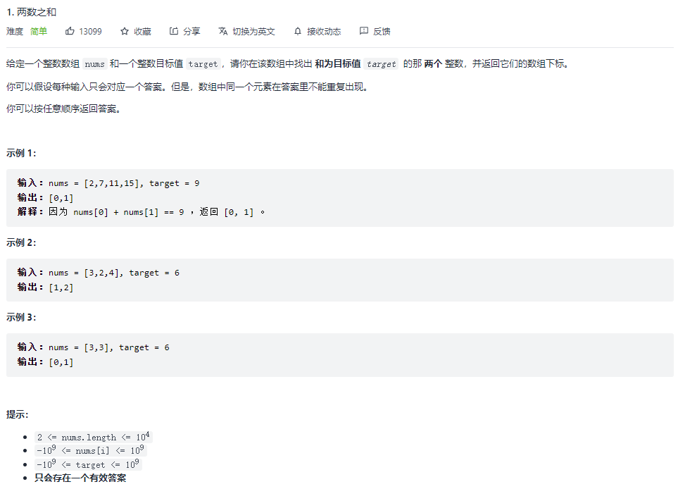

### 1.2 题解

① 暴力求解

外层遍历数组中，内层遍历当前数的索引之后的数

```js
var twoSum = function (nums, target) {
  for (let i = 0; i < nums.length - 1; i++) {
    for (let j = i + 1; j < nums.length; j++) {
      if (nums[i] + nums[j] === target) {
        return [i,j]
      }
    }
  }
};
```


② 使用哈希表Map

仅需遍历一次数组使用哈希表，每次查询是否存在`target - 当前数`的数存在于Map中，不存在将当前数添加至Map中，存在则找到并返回结果。

```js
var twoSum = function(nums, target) {
  const map = new Map()
  for (let i = 0; i < nums.length; i++) {
    const n = target - nums[i]
    if(map.has(n)) {
      return [map.get(n), i]
    } else {
      map.set(nums[i], i)
    }
  }
};
```

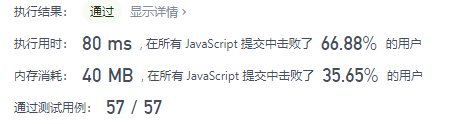

### 1.3 总结

[JavaScript中的Map、Set及其遍历](https://www.cnblogs.com/williamjie/p/9765815.html)


## 2. 两数相加

### 2.1 题目

[LeetCode 链接](https://leetcode-cn.com/problems/add-two-numbers/)

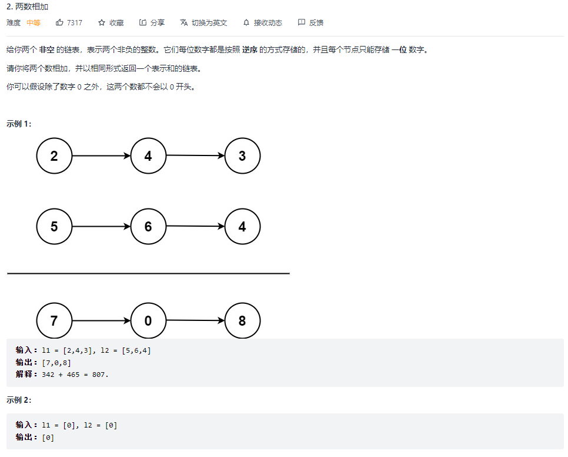

### 2.2 题解

从个位数往后加，注意保存进位情况。

```js
var addTwoNumbers = function(l1, l2) {
  const head = new ListNode()
  let current = head
  let carry = 0 // 进位
  while(l1 || l2) {
    // 保存当前位的值，不存在则为0
    const x = l1 ? l1.val : 0
    const y = l2 ? l2.val : 0
    // 计算和，保存进位
    const sum = x + y + carry
    carry = Math.floor(sum / 10)
    // 创建节点，保存当前位,并且绑定至current节点
    current.next = new ListNode(sum % 10)
    // 改变current, l1, l2节点的指向，进行下一次遍历
    current = current.next
    if(l1) l1 = l1.next
    if(l2) l2 = l2.next
  }
  // 如果最后一次计算还存在进位，添加至最后一位
  if(carry) current.next = new ListNode(carry)
  return head.next
};
```


### 2.3 总结

有关链表的题目，很多时候都需要有一个`current`用来指向当前循环的节点。


## 3. 无重复字符的最长子串

### 3.1 题目

[LeetCode 链接](https://leetcode-cn.com/problems/longest-substring-without-repeating-characters/)

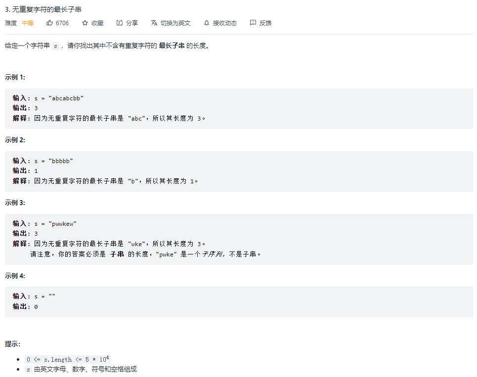

### 3.2 题解

① 暴力求解

遍历字符串，从当前字符串索引往后遍历，使用set存储，若set中不存在则将当前字符添加至set中，直至当前字符存在于set中，比较当前set长度和最大长度并保存大的数。

```js
var lengthOfLongestSubstring = function(s) {
  let max = 0
  for(let i = 0; i < s.length; i++) {
    const set = new Set()
    let j = i
    // 如果没到最后一位并且set中不存在当前字符，则set中添加
    while(j < s.length && !set.has(s[j])) {
      set.add(s[j])
      j++
    }
    max = Math.max(max, j - i)
  }
  return max
};
```


② 滑动窗口

仅需遍历一次字符串，如果窗口右边界的右边字符在窗口里已经存在，删除相同字符所在索引前面全部的字符,将右边的字符添加入窗口

```js
var lengthOfLongestSubstring = function(s) {
  let max = 0
  const arr = []
  for(let i = 0; i < s.length; i++) {
    const index = arr.indexOf(s[i])
    // 若存在相同字符，删除相同字符前全部的字符
    if(index !== -1) {
      arr.splice(0, index + 1)
    }
    // 添加当前字符
    arr.push(s[i])
    max = Math.max(max, arr.length)
  }
  return max
};
```

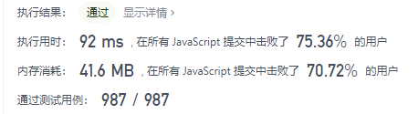

### 3.3 总结

**滑动窗口**其实就是一个队列，左边移出，右边移入，仅需遍历一次。


## 4. 寻找两个正序数组的中位数

### 4.1 题目

[LeetCode 链接](https://leetcode-cn.com/problems/median-of-two-sorted-arrays/)

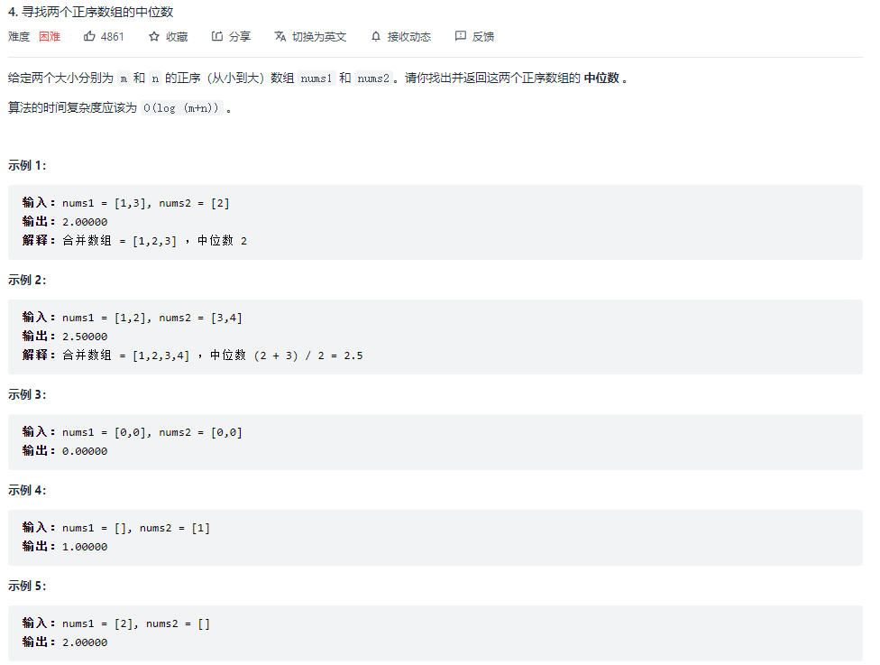

### 4.2 题解

① 合并后排序

合并两个数组为一个数组，然后对合并的数组进行排序，最后得到中位数

```js
var findMedianSortedArrays = function(nums1, nums2) {
  // 合并数组
  const nums = [...nums1,...nums2]
  // 数组排序
  nums.sort((a, b) => a - b)
  const len = nums.length
  // 分数组元素个数的奇偶，返回中位数
  if(len % 2) {
    return nums[(len - 1) / 2]
  } else {
    return (nums[len / 2 - 1] + nums[len / 2]) / 2
  }
};
```


② 二分查找

```js
// 总的思路就是各取一半，对比两个数组取到的最大值（设为a，b）
// 如果a<=b,那么第一个数组从第一个开始到a在内的元素都不是目标元素，缩小目标区间
// 如果a>=b，那么第二个数组从第一个开始到b在内的元素都不是目标元素，缩小目标区间
// 每一次缩小k/2个 （k为中位数）
 var findMedianSortedArrays = function (nums1, nums2) {
    let n = nums1.length
    let m = nums2.length
    // 加一是为了取中间数，不然下取整取的不对,对偶数没影响
    let mid = (m + n + 1) >> 1
    // 基数
    let a = bsearch(nums1, nums2, 0, 0, mid)
    if((m+n)%2==1) return a
    // 偶数 
    // 需要中间两个 所以+1
    let b = bsearch(nums1, nums2, 0, 0, mid+1)
    return (a+b)/2
    // 需要递归调用 所以传入下标
    function bsearch(nums1, nums2, i, j, k){
        // 某个数组空了，剩下的个数取另一个没空的数组的值
        if(nums1.length==i){
            return nums2[j+k-1]
        }
        if(nums2.length==j){
            return nums1[i+k-1]
        }
        // 还差一个  那就比下开头的值
        if(k==1){
            return nums1[i]<nums2[j]?nums1[i]:nums2[j]
        }
        // 正常情况
        // 第一个取a个  可能存在数量不够的情况
        let a = Math.min(k>>1,nums1.length-i)
        // 第二个取b个  也可能不够
        let b = Math.min(k-a,nums2.length-j)
        a = k-b
        // 说明第一个数组的前半段a个元素可以排除了
        if(nums1[i+a-1]<=nums2[j+b-1]){
            return bsearch(nums1, nums2,i+a,j,k-a)
        }
        return bsearch(nums1, nums2,i,j+b,k-b)
    }
};
```


### 4.3 总结

`Array.sort()`方法默认排序顺序是在将元素转换为字符串，然后比较它们的UTF-16代码单元值。数组按数字大小，从小到大排序为：

```js
nums.sort((a, b) => a - b)
```

使用二分查找空间复杂度低，但实现较为复杂。


## 5. 最长回文子串

### 5.1 题目

[LeetCode 链接](https://leetcode-cn.com/problems/longest-palindromic-substring/)

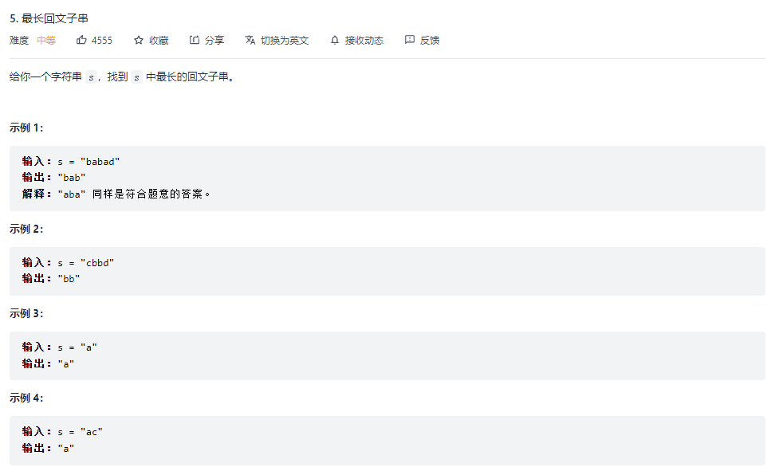

### 5.2 题解

回文子串即字符串两边元素是对称的。

使用左右指针，从当前元素向两边扩散。(**分奇偶情况**，寻找奇数最长时左右指针指向同一个，寻找偶数最长时左右指针指向相邻两个)

```js
var longestPalindrome = function(s) {
  let res = ''
  for(let i = 0; i < s.length; i++) {
    // 寻找长度为奇数的最大回文子串
    const s1 = find(s, i, i)
    // 寻找长度为偶数的最大回文子串
    const s2 = find(s, i, i + 1)
    // 将当前最长的赋值给res
    res = res.length > s1.length ? res : s1
    res = res.length > s2.length ? res : s2
  }
  return res
};

// 寻找左右指针为中心的最大回文字符串
function find (s, l, r) {
  while (l >= 0 && r < s.length && s[l] === s[r]) {
    l--
    r++
  }
  return s.slice(l + 1, r)
}
```


### 5.3 总结

**中心扩散法**：从每一个位置出发，向两边扩散。


## 10. 正则表达式匹配

### 10.1 题目

[LeetCode 链接](https://leetcode-cn.com/problems/regular-expression-matching/)

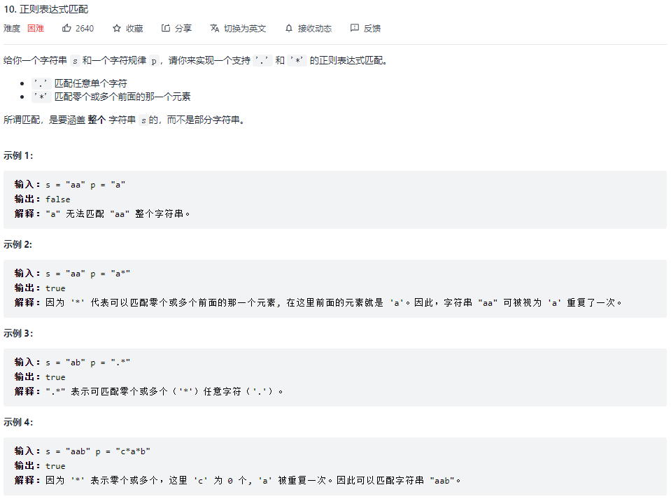

### 10.2 题解

① 直接使用正则表达式

```js
var isMatch = function(s, p) {
  const reg = new RegExp(`^${p}$`)
  return reg.test(s)
};
```

② 通过代码实现正则表达式


### 10.3 总结

[正则表达式的使用方法](https://www.cnblogs.com/lnlvinso/p/10467941.html)

[正则表达式在线验证](https://regexr-cn.com/)


## 11. [盛最多水的容器](https://leetcode-cn.com/problems/container-with-most-water/)

### 11.1 题目

[LeetCode 链接](https://leetcode-cn.com/problems/container-with-most-water/)


### 11.2 题解

使用双指针法，在较短的一边从外向内缩小，比较更新最大值。

```js
var maxArea = function(height) {
  // 定义左右指针
  let l = 0, r = height.length - 1
  let max = 0
  while(l < r) {
    // 找到短边
    const minH = Math.min(height[l], height[r])
    // 比较大小，更新最大值
    max = Math.max(max, minH * (r - l))
    // 短的一边像中间靠
    if(height[l] === minH) {
      l++
    } else {
      r--
    }
  }
  return max
};
```


### 11.3 总结

要矩形面积最大化，**两条垂直线的距离越远越好**，**两条垂直线的最短长度也要越长越好**。

我们设置两个指针 `left` 和 `right`，分别指向数组的最左端和最右端。此时，两条垂直线的距离是最远的，若要下一个矩阵面积比当前面积来得大，必须要把 `height[left]` 和 `height[right]` 中较短的垂直线往中间移动，看看是否可以找到**更长的垂直线**。


## 15. 三数之和

### 15.1 题目

[LeetCode 链接](https://leetcode-cn.com/problems/3sum/)

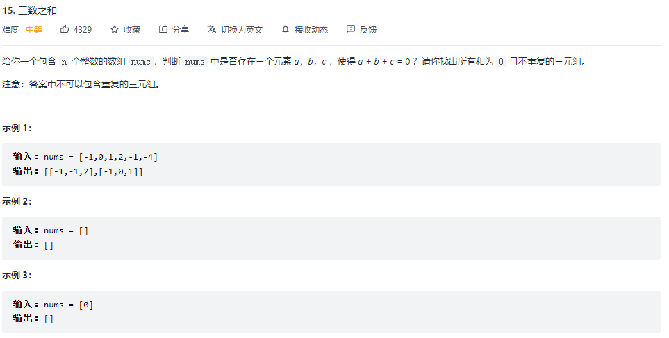

### 15.2 题解

排序后遍历，注意去重。

+ 首先对数组进行排序，排序后固定一个数 `nums[i]`，再使用左右指针指向 `nums[i]` 后面的两端，数字分别为 `nums[L]` 和 `nums[R]`，计算三个数的和 `sum` 判断是否满足为 0，满足则添加进结果集
+ 如果 `nums[i]`大于 0，则三数之和必然无法等于 0，结束循环
+ 如果 `nums[i] === nums[i-1]`，则说明该数字重复，会导致结果重复，所以应该跳过
+ 当 `sum === 0` 时，`nums[l] === nums[l+1]` 则会导致结果重复，应该跳过，l++
+ 当 `sum === 0` 时，`nums[r] === nums[r−1]` 则会导致结果重复，应该跳过，r--

```js
var threeSum = function(nums) {
  const res = []
  nums.sort((a,b) => a - b)
  for(let i = 0; i < nums.length - 2 && nums[i] <= 0; i++) {
    if (i > 0 && nums[i] === nums[i - 1]) continue // 去重
    let l = i + 1, r = nums.length - 1
    while(l < r) {
      const sum = nums[l] + nums[r] + nums[i]
      if(sum === 0) {
        res.push([nums[i], nums[l], nums[r]])
        while (nums[l] === nums[l + 1]) l++ // 去重
        while (nums[r] === nums[r - 1]) r-- // 去重
        l++
        r--
      } else if (sum > 0) {
        r--
      } else {
        l++
      }
    }
  }
  return res
};
```


### 15.3 总结

三个数使用双指针法，<u>固定一个数，对第一个数进行遍历</u>，针对第一个数后面的数使用双指针的方法。


## 17. 电话号码的字母组合

### 17.1 题目

[LeetCode 链接](https://leetcode-cn.com/problems/letter-combinations-of-a-phone-number/)

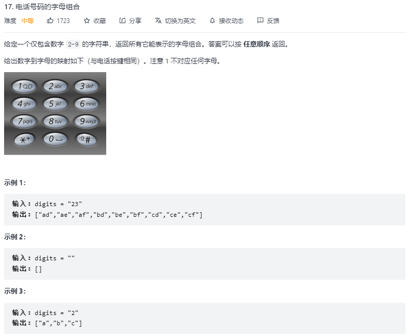

### 17.2 题解

回溯算法，遍历所有的可能。

在每次遍历中，当遍历到 `digits` 最后一个索引之后，将当前的一种结果保存下来，回溯遍历其他的结果并保存。

```js
var letterCombinations = function (digits) {
  if(!digits) return []
  const Arr = ["abc","def","ghi","jkl","mno","pqrs","tuv","wxyz"]
  const temp = [] // 保存当前遍历的结果
  const res = []
  backtrack(0)
  return res

  function backtrack(index) {
    // 当遍历到最后一位之后，保存当前遍历结果
    // 截止条件
    if (index == digits.length) {
      res.push(temp.join(''))
      return
    }
    // 对当前 index 的数字对应的字母进行遍历
    for (let s of Arr[digits[index] - 2]) {
      temp.push(s)
      backtrack(index + 1)
      temp.pop()
    }
  }
};
```


### 17.3 总结

[回溯算法解题套路](https://labuladong.gitee.io/algo/1/5/)


## 19. 删除链表的倒数第 N 个结点

### 19.1 题目

[LeetCode 链接](https://leetcode-cn.com/problems/remove-nth-node-from-end-of-list/)

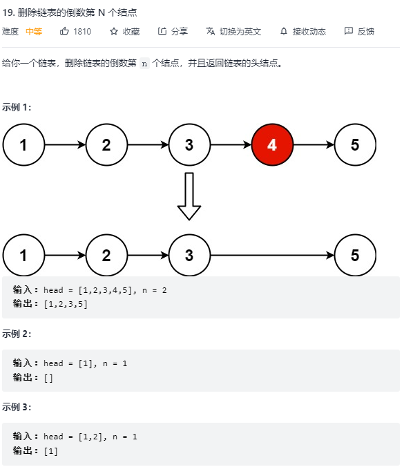

### 19.2 题解

**① map 遍历保存节点**

使用 map 遍历保存所有节点，找到所要删除的节点的位置。

分情况改变节点的指向或头节点。

```js
var removeNthFromEnd = function(head, n) {
  // 创建 map ，遍历保存所有节点和排序号
  const map = new Map()
  let current = head, index = 1
  while(current) {
    map.set(index, current)
    current = current.next
    index++
  }
  // 倒数第 n 个，为正数第 m 个
  const m = index - n

  // 如果删除的是第一个节点，头节点为第二个节点
  if(m == 1) return head.next
  // 删除的不是第一个节点，改变前一个节点的指向
  map.get(m - 1).next = map.get(m).next
  return head
};
```


**② 快慢指针 (双指针)**

快指针和慢指针始终相差 n，当快指针指向最后时，慢指针正好在倒数第n个。

```js
var removeNthFromEnd = function(head, n) {
  let fast = head, slow = head
  let pre = null
  // 让 快慢指针 位置相差 n
  // 这样当快指针指向最后时，慢指针正好在倒数第n个
  for(let i = 0; i < n; i++) {
    fast = fast.next
  }

  // 如果删除的是第一个，fast会指向 null，直接返回头节点的下一个节点
  if(!fast) return head.next
  // 快慢指针同时往后走，保存前一个慢节点
  while(fast) {
    pre = slow
    fast = fast.next
    slow = slow.next
  }
  
  // 改变前一个节点的指向
  pre.next = slow.next
  return head
};
```


### 19.3 总结

[JavaScript中的Map、Set及其遍历](https://www.cnblogs.com/williamjie/p/9765815.html)

找寻倒数第n个数，可以使用**快慢指针**的方法。


## 20. 有效的括号

### 20.1 题目

[LeetCode 链接](https://leetcode-cn.com/problems/valid-parentheses/)

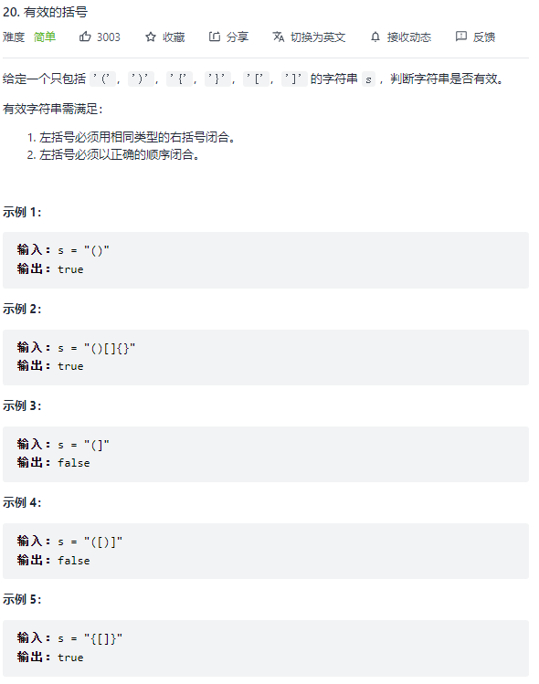

### 20.2 题解

**① 正则表达式**

```js
var isValid = function(s) {
  // 匹配相同括号在一起的
  const reg = /(\(\))|(\[\])|(\{\})/g
  // 不断删除在一起的相同括号
  while (s.match(reg)) {
    s = s.replace(reg, '')
  }
  // 若最后为空，则表示有效
  return s === ''
};
```

**② 使用栈解决**

```js
var isValid = function(s) {
  dic = {
  '(': ')',
  '[': ']',
  '{': '}'
  }
  // 栈存放当前括号
  const stack = []
  // 遍历括号
  for (let i of s) {
    // 当是左括号时，保存
    if (i in dic) {
      stack.push(i)
    } else {
      // 如果不是左括号，判断是否和栈中最后一个括号匹配
      // 不匹配则返回 false, 匹配则取出栈中最后一个
      if (dic[stack.pop()] !== i) return false
    }
  }
  // 最后栈中为空则表示括号有效
  return stack.length === 0
};
```

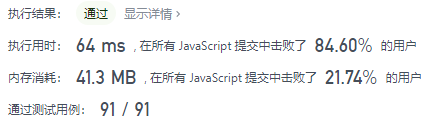

### 20.3 总结

判断对象中是否含有指定的属性：

```js
const bool = key in obj
```


## 21. 合并两个有序链表

### 21.1 题目

[LeetCode 链接](https://leetcode-cn.com/problems/merge-two-sorted-lists/)

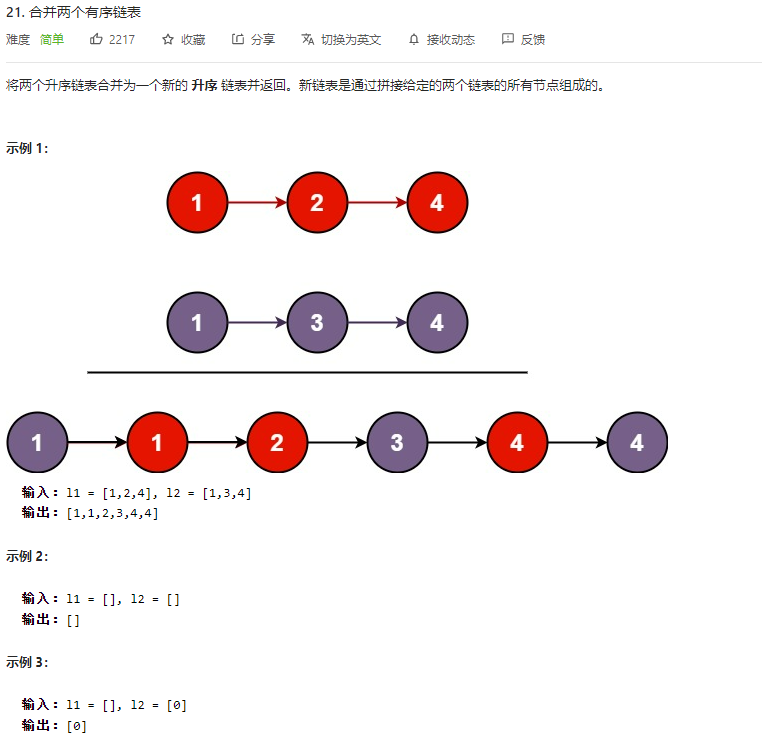

### 21.2 题解

**① 递归**

+ 当其中一个链表为空时，返回另一个链表，相当于余下的接在尾部

```js
var mergeTwoLists = function(list1, list2) {
  // 递归
  // 当其中一个链表为空时，返回另一个链表，相当于余下的接在尾部
  if(list1 == null) return list2
  if(list2 == null) return list1
    
  // 让节点值较小的节点 next 和另一个链表继续递归合并
  if(list1.val < list2.val) {
    list1.next = mergeTwoLists(list1.next, list2)
    return list1
  } else {
    list2.next = mergeTwoLists(list1, list2.next)
    return list2
  }
};
```


**② 双指针**

+ 两个指针分别指向两个链表的头部，创建一个新的空链表

+ 当 `node1` `node2` 都不为空时，比较大小，小的加入新链表，改变指针指向
+ 直至一个为空时，新链表的尾部指向余下的链表

```js
var mergeTwoLists = function (list1, list2) {
  // 双指针
  let node1 = list1
  let node2 = list2
  // 创建新的空链表
  let newList = new ListNode(0)
  let node = newList
  // 比较大小，小的加入新链表，并改变指针指向
  while (node1 && node2) {
    if (node1.val <= node2.val) {
      node.next = node1
      node1 = node1.next
    } else {
      node.next = node2
      node2 = node2.next
    }
    node = node.next
  }
  // 当一个为空时，新链表的尾部指向余下的链表
  if (node1) node.next = node1
  if (node2) node.next = node2
  return newList.next
}
```


### 21.3 总结

当一个链表遍历完成后，另外一个可以不用遍历，直接将余下的头节点接在当前尾部即可。


## 22. 括号生成

### 22.1 题目

[LeetCode 链接](https://leetcode-cn.com/problems/generate-parentheses/submissions/)

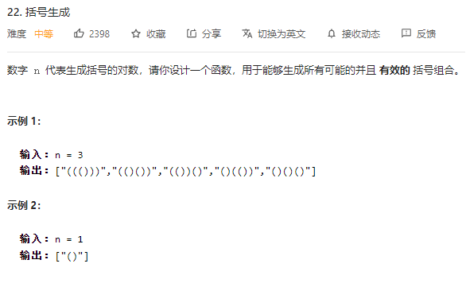

### 22.2 题解

回溯算法，遍历过程中括号合理的条件：

+ 左括号数大于等于右括号数
+ 左括号小于等于括号总个数

```js
var generateParenthesis = function(n) {
  const Arr = ['(', ')']
  const temp = [] // 保存当前遍历的结果
  const res = []
  backtrack(0, 0, 0)
  return res

  // index 表示当前遍历进度, left 表示左括号的个数, right 表示右括号的个数
  function backtrack(index, left, right) {
    // 当左括号数小于右括号数，或者左括号大于括号个数时，不符合直接返回
    if(left < right || left > n) {
      return
    }
    // 当总个数等于2n时，保存本次遍历结果，并返回
    if(index === 2 * n) {
      res.push(temp.join(''))
      return
    }

    // 遍历每个 index 所有的可能，即 左括号 或 右括号
    for(let i = 0; i < 2; i++) {
      // 根据是左括号或右括号，改变 left 或 right
      if(i == 0) left++
      else right++
      
      temp.push(Arr[i])
      backtrack(index + 1, left, right)
      // 回溯之后，要根据是哪种括号，回溯 left 或 right
      if(i == 0) left--
      else right--
      temp.pop()
    }
  }
};
```


只有两个需要遍历的选项，可以选择思路更清晰的解法:

```js
var generateParenthesis = function (n) {
  let res = [];
  // 用leftRemain记录还可以使用多少个左括号，用rightRemain记录还可以使用多少个右括号
  const backtrack = (leftRemain, rightRemain, str) => {
    // 左右括号所剩的数量，str是当前构建的字符串
    if (str.length == n * 2) return res.push(str);
    // 只要左括号有剩，就可以选它，然后继续做选择（递归）
    if (leftRemain > 0) backtrack(leftRemain - 1, rightRemain, str + "(");
    // 只有右括号比左括号剩的多，才能选右括号
    if (rightRemain > leftRemain)
      backtrack(leftRemain, rightRemain - 1, str + ")");
  };
  // 递归的入口，剩余数量都是n，初始字符串是空串
  backtrack(n, n, "");
  return res;
};
```


### 22.3 总结

使用回溯算法的时候，如果可能性少，可以直接代入，不必都用套路。


## 23. 合并K个升序链表

### 23.1 题目

[LeetCode 链接](https://leetcode-cn.com/problems/merge-k-sorted-lists/)

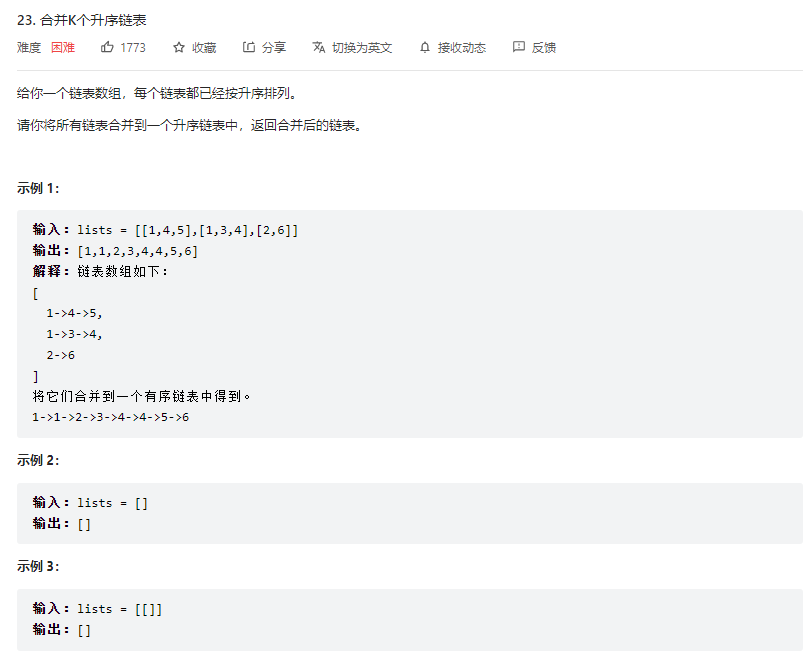

### 23.2 题解

**① 利用 `21. 合并两个有序链表`**

通过多个两项合并，实现多项合并

```js
 // 21. 合并两个有序链表
var mergeTwoLists = function(list1, list2) {
  if(list1 == null) return list2
  if(list2 == null) return list1
    
  if(list1.val < list2.val) {
    list1.next = mergeTwoLists(list1.next, list2)
    return list1
  } else {
    list2.next = mergeTwoLists(list1, list2.next)
    return list2
  }
};

var mergeKLists = function(lists) {
  if(!lists || !lists.length) return null
  let res = lists[0]
  for(let i = 1; i < lists.length; i++) {
    res = mergeTwoLists(res, lists[i])
  }
  return res
};
```


**② 遍历后排序并创建新链表**

```js
var mergeKLists = function(lists) {
    if(!lists || !lists.length) return null
    let len  = lists.length
    let arr = []
    // 将所有的 val 存放在 arr 中
    for(let i = 0;i<len;i++){
        let temp = lists[i]
        while(temp){
            arr.push(temp.val)
            temp = temp.next
        }
    }
    // 对所有的 val 进行排序
    arr.sort((a,b)=>a-b)
    let head = new ListNode()
    let cur = head
    // 创建新链表
    for(let i = 0,len = arr.length;i<len;i++){
        let node = new ListNode(arr[i])
        cur.next = node
        cur = cur.next
    }
    return head.next
};
```

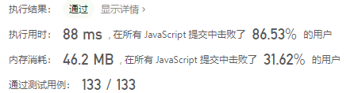

### 23.3 总结

可以考虑把链表问题转换成数组问题，再重新创建链表得到结果。


## 31. 下一个排列

### 31.1 题目

[LeetCode 链接](https://leetcode-cn.com/problems/next-permutation/)

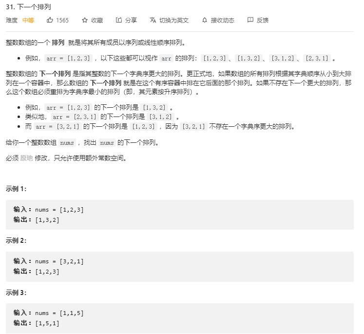

### 31.2 题解

根据题意，可以理解为：

+ 从后向前寻找，直至后面一个数大于前面一个数
+ 那么就是改变，从前面一个数开始的后面的数，放入数组 `Arr2` 中
+ 找出在 `Arr2` 中比第一个数 大的数中 差距最小的，并放在最前面
+ 之后将 `Arr2` 中后面的数从小到大排序即可

```js
var nextPermutation = function(nums) {
  if(nums.length == 1) return
  // 保存不需要变位置的元素
  let Arr1
  // 保存需要变位置的元素
  let Arr2
  // 保存需要改变的数在 nums 中的位置
  let i = nums.length - 1

  // 遍历找到第一个 后一个数比前一个数大的 位置，并保存前后元素
  for (; i > 0; i--) {
    if (nums[i] > nums[i - 1]) {
      Arr1 = nums.slice(0, i - 1)
      Arr2 = nums.slice(i - 1)
      break
    }
    // 如果到最后都没出现后一个比前一个大，说明为最后一个排序，只需翻转当前数组
    if (i === 1) return nums.reverse()
  }

  // 对 Arr2 进行排序
  Arr2.sort((a, b) => a - b)
  // 找到 Arr2 中比 需要改变的数中最前面的数 大的数中 差距最小的
  const index = Arr2.lastIndexOf(nums[i - 1])
  // 将该数从 Arr2 中拿出
  const first = Arr2[index + 1]
  Arr2.splice(index + 1, 1)
  
  // 重新拼接得到结果
  // return nums = [...Arr1, first, ...Arr2]
  // 题目要求只修改 nums 的值
  nums[i -1] = first
  for(let j = 0; j < Arr2.length; j++) {
    nums[i] = Arr2[j]
    i++
  }
  return
};
```


### 31.3 总结

`arr.indexOf(item)` 找寻 `arr` 数组中第一个元素 `item` 的索引。

`arr.lastIndexOf(item)` 找寻 `arr` 数组中最后一个元素 `item` 的索引。


## 32. 最长有效括号

### 32.1 题目

[LeetCode 链接](https://leetcode-cn.com/problems/longest-valid-parentheses/)

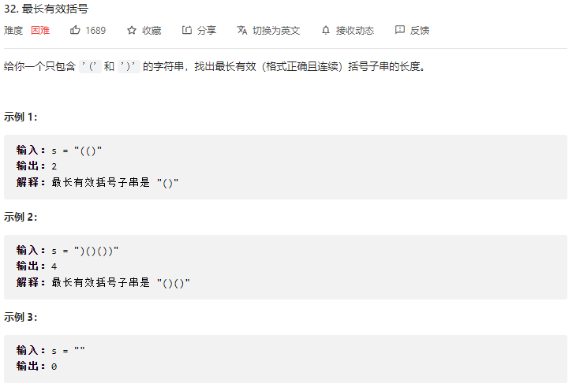

### 32.2 题解

对字符串的初始位置进行遍历，找到每个位置起始往后，最长的有效子串

括号无效的条件：

+ 左括号数量小于右括号数量
+ (或者)左括号数量超过总长度的一半

```js
var longestValidParentheses = function (s) {
  let max = 0
  // 从初始索引i,往后找寻最长的有效子串
  for (let i = 0; i < s.length; i++) {
    // 如果剩余的长度小于max,可以直接返回 max
    if (s.length - i - 1 <= max) return max
    maxLen(0, 0, i)
  }
  return max

  // 找寻从当前位置开始,最长的有效子串
  function maxLen(left, right, index) {
    for (let j = index; j < s.length; j++) {
      // 当 左括号小于右括号 或者 左括号数量超过总长度的一半 时,推出循环
      if (left < right || left > s.length / 2) break
      if (s[j] == '(') left++
      if (s[j] == ')') right++
      if (left == right) max = Math.max(max, left * 2)
    }
  }
};
```

### 32.3 总结

关于括号有效的问题，需要记得括号无效的条件，即：

**左括号数量小于右括号数量** 或者 **左括号数量超过总长度的一半**


## 33. 搜索旋转排序数组

### 33.1 题目

[LeetCode 链接](https://leetcode-cn.com/problems/search-in-rotated-sorted-array/)

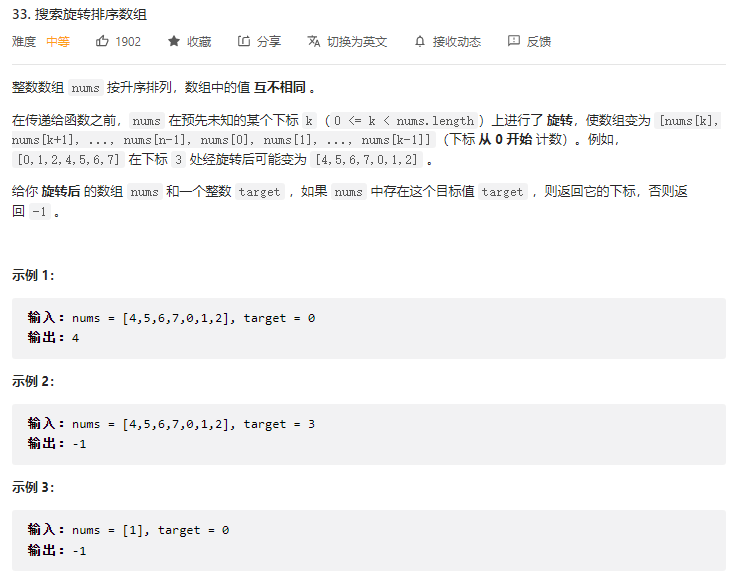

### 33.2 题解

使用二分法，注意指针的变化

+ 先根据 `nums[mid]` 与 `nums[l]` 的关系判断 `mid` 是在左段还是右段 
+ 再判断 `target` 是在 `mid` 的左边还是右边，从而调整左右边界 `l` 和 `r`

```js
var search = function(nums, target) {
  // 二分法
  let l = 0, r = nums.length - 1
  while(l <= r) {
    const mid = (l + r) >> 1
    if(nums[mid] === target) {
      return mid
    }
    if(nums[mid] >= nums[l]) { // 先根据 nums[mid] 与 nums[l] 的关系判断 mid 是在左段还是右段 
      // 再判断 target 是在 mid 的左边还是右边，从而调整左右边界 l 和 r
      if (target >= nums[l] && target < nums[mid]) { // 左段，往左缩
        r = mid - 1
      } else {
        l = mid + 1
      }   
    } else {
      if (target <= nums[r] && target > nums[mid]) { // 右段，往右缩
        l = mid + 1
      } else {
        r = mid - 1
      }   
    }
  }
  return -1
};
```

### 33.3 总结

二分法注意条件的判断，注意如何改变指针。


## 34. 在排序数组中查找元素的第一个和最后一个位置

### 34.1 题目

[LeetCode 链接](https://leetcode-cn.com/problems/find-first-and-last-position-of-element-in-sorted-array/)

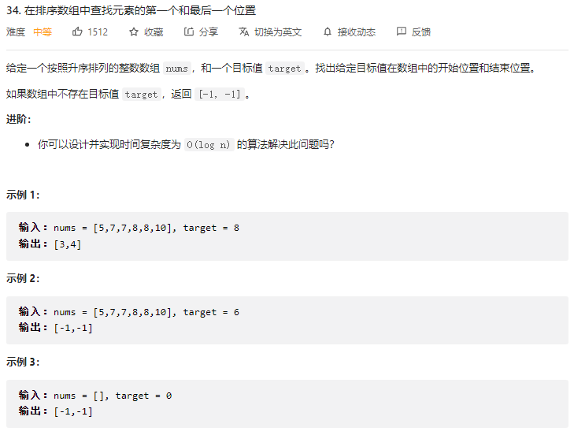

### 34.2 题解

两次二分法，分别找到左右边界

+ 找右边界 `l` 时，条件为 `nums[mid] <= target` ，此时 `l=mid+1` 移至右边，最终可以找到右边界的右边一个数
+ 找左边界 `rr` 时，条件为 `nums[mid] < target` ,相当于 `nums[mid] >= target`，此时 `rr=mid-1` 移至左边，最终可以找到左边界的左边一个数
+ 最后判断 `l`处右边的一个一个数是否等于 `target`，以此判断是否找到，没找到则返回 `[-1, -1]`

```js
var searchRange = function(nums, target) { 
  // 找右边界
  let l = 0, r = nums.length - 1
  while(l <= r) {
    const mid = (l + r) >> 1
    if(nums[mid] <= target) {
      l = mid + 1
    } else {
      r = mid - 1
    }
  }

  // 找左边界
  let ll = 0, rr = nums.length - 1
  while(ll <= rr) {
    const mid = (ll + rr) >> 1
    if(nums[mid] < target) {
      ll = mid + 1
    } else {
      rr = mid - 1
    }
  }

  // l:右边界的右边一个数, rr：左边界的左边一个数
  if(nums[l - 1] !== target) return [-1, -1]
  return [rr + 1, l - 1]
};
```

### 34.3 总结

同 [剑指 Offer 53 - I. 在排序数组中查找数字 I](https://leetcode-cn.com/problems/zai-pai-xu-shu-zu-zhong-cha-zhao-shu-zi-lcof/)


## 39. 组合总和

### 39.1 题目

[LeetCode 链接](https://leetcode-cn.com/problems/combination-sum/)

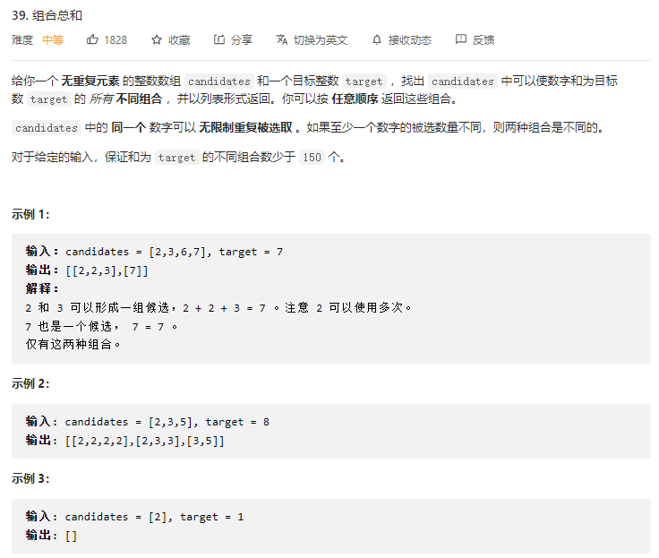

### 39.2 题解

dfs算法，每次从当前其实位置往后遍历，可以避免出现重复的结果。

```js
var combinationSum = function(candidates, target) {
  const res = []
  const path = []
  dfs(0, 0)
  return res
  
  // start 表示此次遍历的起始位置, sum 表示 path 中的数的和
  function dfs(start, sum) {
    if(sum === target) {
      res.push(path.slice())
      return
    }
    if(sum > target) {
      return
    }
	
    for(let i = start; i < candidates.length; i++) {
      if(candidates[i] > target) continue
      path.push(candidates[i])
      dfs(i, sum + candidates[i])
      path.pop()
    }
  }
};
```

### 39.3 总结

注意回溯时后的起始位置，相关题目：

[78. 子集（中等）](https://leetcode-cn.com/problems/subsets)

[90. 子集 II（中等）](https://leetcode-cn.com/problems/subsets-ii)

[77. 组合（中等）](https://leetcode-cn.com/problems/combinations)

[39. 组合总和（中等）](https://leetcode-cn.com/problems/combination-sum)

[40. 组合总和 II（中等）](https://leetcode-cn.com/problems/combination-sum-ii)

[216. 组合总和 III（中等）](https://leetcode-cn.com/problems/combination-sum-iii)

[46. 全排列（中等）](https://leetcode-cn.com/problems/permutations)

[47. 全排列 II（中等）](https://leetcode-cn.com/problems/permutations-ii)


## 42. 接雨水

### 42.1 题目

[LeetCode 链接](https://leetcode-cn.com/problems/trapping-rain-water/)

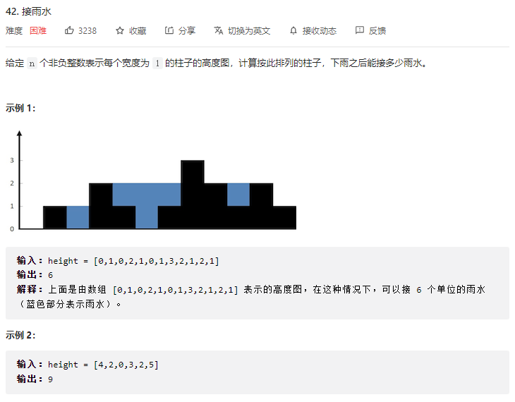

### 42.2 题解

+ 双指针，哪一边的最大高度小，哪一边就往中间移动
+ 对于某一列，能接到的雨水，**等于 min(左边最大值，右边最大值) - 当前列的值**

```js
var trap = function(height) {
  let l = 0, r = height.length - 1
  let maxL = 0, maxR = 0
  let res = 0
  // 双指针,哪一边的最大高度小,哪一边就往中间移动
  while(l < r) {
    maxL = Math.max(maxL, height[l])
    maxR = Math.max(maxR, height[r])
    if(maxL < maxR) {
      // 接水量增加l位置处的蓄水量(即 左边最大高度 - 当前高度)
      res += maxL - height[l]
      l++
    } else {
      res += maxR - height[r]
      r--
    }
  }
  return res
};
```

### 42.3 总结

深入理解题目意思，找到规律。


## 46. 全排列

### 46.1 题目

[LeetCode 链接](https://leetcode-cn.com/problems/permutations/)

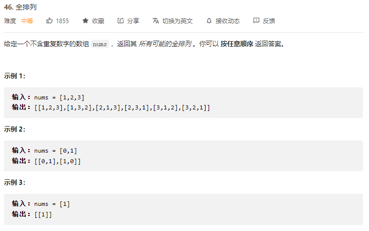

### 46.2 题解

dfs 算法，`visited` 数组，保存记录已经访问的项。

```js
var permute = function(nums) {
  const visited = new Array(nums.length).fill(0)
  const path = []
  const res = []
  dfs(0)
  return res

  function dfs(index) {
    if(index === nums.length) {
      // path.slice() 可以将 path 拷贝一份，否则后面path会发生改变
      res.push(path.slice())
      return
    }

    for(let i = 0; i < nums.length; i++) {
      // 筛选出满足条件的继续
      if(visited[i] === 0) {
        path.push(nums[i])
        visited[i] = 1
        dfs(index + 1)
        visited[i] = 0
        path.pop()
      }
    }
  }
};
```

### 46.3 总结

39题 列出了全部关于 排列/组合/子集的 等问题，都可以用dfs算法解决。

由于该题是不分顺序的，不好直接遍历，所以此题使用了`visited` 数组，记录已经访问的项。

使用 `path.slice()`方法，复制一份当前的 `path`，否则最后 push 进 `res` 的就存在问题。


## 48. 旋转图像

### 48.1 题目

[LeetCode 链接](https://leetcode-cn.com/problems/rotate-image/)

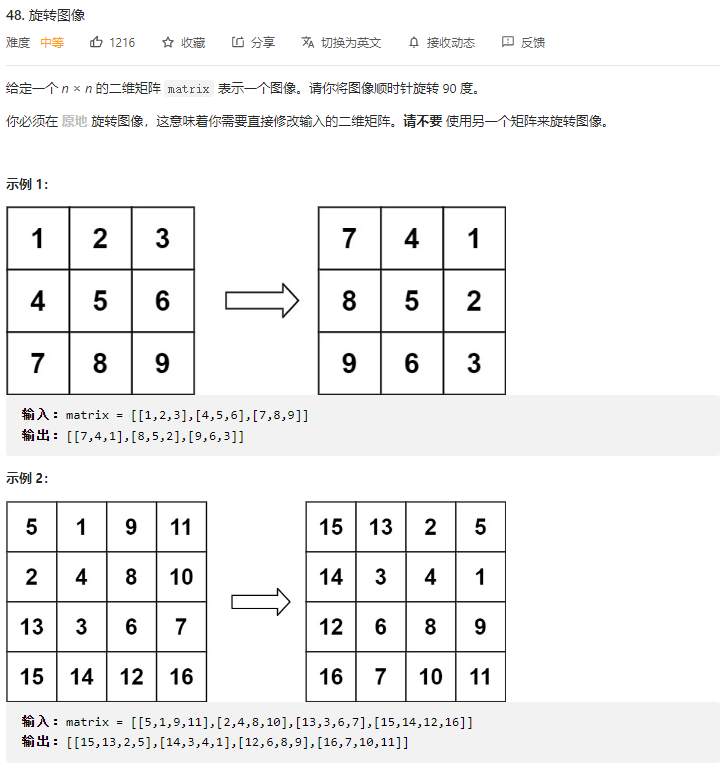

### 48.2 题解

从上往下逐层遍历，交换对应的四个元素。

+ 根据对称性，可以想到只需遍历一半的层数
+ 下层的元素当中会包含上层已经遍历的元素，需要去除
+ 四个位置的坐标分别为 `[i, j]` `[j, len -i-1]` `[len-i-1, len-j-1]` `[len-j-1, i]`
+ 通过解构赋值交换元素

```js
var rotate = function(matrix) {
  const len = matrix.length
  const x = len >> 1
  // 层数仅需遍历一半
  for(let i = 0; i <= x; i++) {
    // 下层的列的遍历中，需要去除上层已经遍历的元素
    for(let j = i; j < len - 1 - i; j++) {
      // 需要调换位置的四个坐标分别为[i, j] [j, len -i-1] [len-i-1, len-j-1] [len-j-1, i]
      // 通过解构赋值,交换数组元素
      [matrix[i][j], matrix[j][len - i - 1], matrix[len - i -1][len - j - 1], matrix[len - j -1][i]] = 
      [matrix[len - j -1][i], matrix[i][j], matrix[j][len - i - 1], matrix[len - i -1][len - j - 1]]
    }
  }
};
```


### 48.3 总结

通过思考转换成数学问题，找每个交换元素的坐标。


## 49. 字母异位词分组

### 49.1 题目

[LeetCode 链接](https://leetcode-cn.com/problems/group-anagrams/)

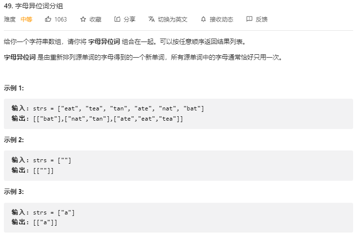

### 49.2 题解

通过 Map 保存已有的元素组合，通过转换成数组再进行排序，可以得到统一的 key 值，以此判断是否重复。

```js
var groupAnagrams = function(strs) {
  const map = new Map()
  // sort() 方法将字母按序排列, 将相同的存放在同一个 key 中
  for(let item of strs) {
    const key = item.split("").sort().join("")
    map.has(key) ? map.get(key).push(item) : map.set(key, [item])
  }
  // map.values() 遍历map
  return Array.from(map.values())
};
```


### 49.3 总结

对字符串进行排序可以先转换成数组，排序后再转换成字符串。


## 53. 最大子数组和

### 53.1 题目

[LeetCode 链接](https://leetcode-cn.com/problems/maximum-subarray/)

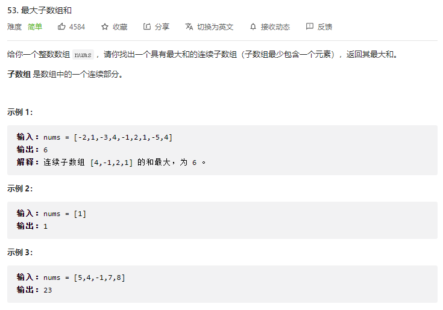

### 53.2 题解

动态规划，`dp[i]` 表示以 `nums[i]` 结尾的子数组最大和。

+ 若 `dp[i - 1]` 为正，`dp[i] = dp[i - 1] + nums[i]`

+ 若 `dp[i - 1]` 不为正，`dp[i] = nums[i]`

```js
var maxSubArray = function(nums) {
  // dp[i] 表示以 nums[i] 结尾的子数组最大和
  const dp = new Array(nums.length)
  dp[0] = nums[0]
  let max = dp[0]
  for(let i = 1; i < nums.length; i++) {
    if(dp[i - 1] > 0) {
      dp[i] = dp[i - 1] + nums[i]
    } else {
      dp[i] = nums[i]
    }
    max = Math.max(max, dp[i])
  }
  return max
};
```


### 53.3 总结

动态规划问题，找到转移方程和dp数组的含义是关键。


## 55. 跳跃游戏

### 55.1 题目

[LeetCode 链接](https://leetcode-cn.com/problems/jump-game/)

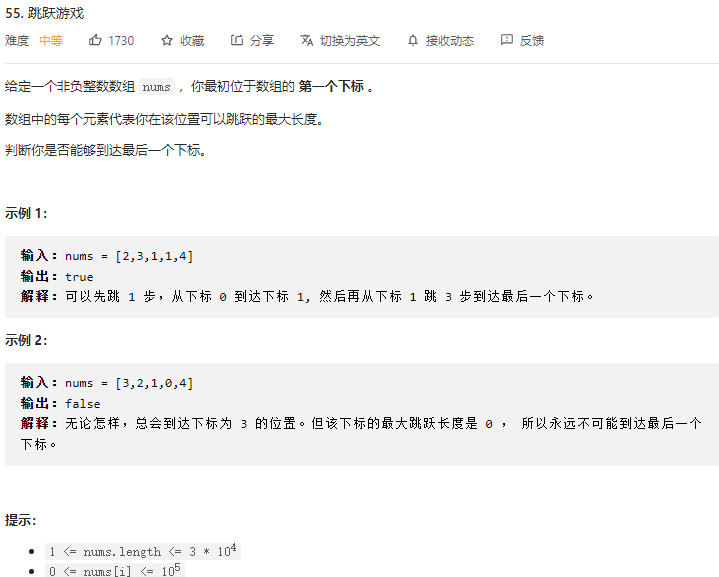

### 55.2 题解

**① 动态规划**

从后往前遍历，dp[i] 表示：位置i能否到达终点。

```js
var canJump = function(nums) {
  const len = nums.length
  // dp[i] 表示 位置i能否抵达终点, 1 表示能到, 0 表示不能到
  const dp = new Array(len).fill(0)
  dp[len - 1] = 1
  // 从后往前遍历
  for(let i = len -2; i >= 0; i--) {
    // 位置i 处，往后寻找 num[i] 范围内是否存在能到终点的位置
    for(j = i; j <= i + nums[i]; j++) {
      if(dp[j] === 1) {
        dp[i] = 1
        break
      }
    }
  }
  return dp[0]
};
```

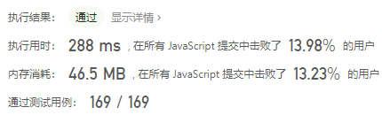

**① 贪心算法**

不用考虑每一步跳跃到那个位置，而是尽可能的跳跃到最远的位置，看最多能覆盖的位置，不断更新能覆盖的距离。

```js
var canJump = function (nums) {
  if (nums.length === 1) return true //长度为1 直接就是终点
  let cover = nums[0] //能覆盖的最远距离
  for (let i = 0; i <= cover; i++) {
    cover = Math.max(cover, i + nums[i]) //当前覆盖距离cover和当前位置加能跳跃的距离中取一个较大者
    if (cover >= nums.length - 1) {
      //覆盖距离超过或等于nums.length - 1 说明能到达终点
      return true
    }
  }
  return false //循环完成之后 还没返回true 就是不能达到终点
};
```


### 55.3 总结

贪心算法：每次操作都是局部最优的，从而使最后得到的结果是全局最优，但结果不一定最优。

[贪心算法](https://xiaochen1024.com/courseware/60b4f11ab1aa91002eb53b18/61963ce5c1553b002e57bf14)


## 56. 合并区间

### 56.1 题目

[LeetCode 链接](https://leetcode-cn.com/problems/merge-intervals/)

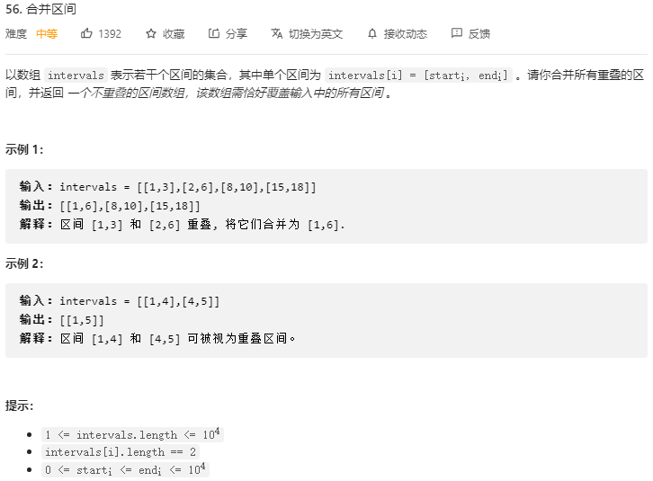

### 56.2 题解

+ 先对数组 `intervals` 进行排序，这样就只用比较右坐标的大小，以此来判断是否重叠
+ 最后 `temp` 中还会存在一个区间，需要在末尾加入 `res` 中

```js
var merge = function(intervals) {
  // 按照第一个位置的大小,从小到大排序
  intervals.sort((a, b) => a[0] - b[0])
  const res = []
  let temp = intervals[0]
  for(let i = 1; i < intervals.length; i++) {
    const item = intervals[i]
    if(temp[1] >= item[0]) {
      // 如果当前区间与 temp 重叠，将大的右坐标作为 temp 的右坐标
      temp[1] = Math.max(temp[1], item[1])
    } else {
      // 如果不重叠，向结果中加入 temp，并重新给 temp 赋值为当前区间
      res.push(temp)
      temp = item
    }
  }
  // 最后 temp 中还有一个区间，需要加入 res
  res.push(temp)
  return res
};
```


### 56.3 总结

逻辑推理，先将数组的首位进行排序是关键。


## 62. 不同路径

### 62.1 题目

[LeetCode 链接](https://leetcode-cn.com/problems/unique-paths/)


### 62.2 题解

动态规划

+ 由于第一行和第一列只有一种走法，所以先初始化第一行、第一列
+ 由于只能向 右 或 下 走，所以当前格子处的路径数 = 左边格子的路径数 + 上边格子的路径数

```js
var uniquePaths = function(m, n) {
  const dp = new Array(m).fill().map(() => new Array(n).fill(0))
  // 第一列,初始化
  for(let i = 0; i < m; i++) {
    dp[i][0] = 1
  }
  // 第一行,初始化
  for(let i = 1; i < n; i++) {
    dp[0][i] = 1
  }
  // 由于只能向 右 或 下 走，所以当前格子处的路径数 = 左边格子的路径数 + 上边格子的路径数
  // [i, j]处的路径数 =  [i - 1][j]路径数 + [i][j - 1]路径数
  for(let i = 1; i < m; i++) {
    for(let j = 1; j < n; j++) {
      dp[i][j] = dp[i - 1][j] + dp[i][j - 1]
    }
  }
  return dp[m - 1][n - 1]
};
```

### 62.3 总结

动态规划基本解法


## 64. 最小路径和

### 64.1 题目

[LeetCode 链接](https://leetcode-cn.com/problems/minimum-path-sum/)

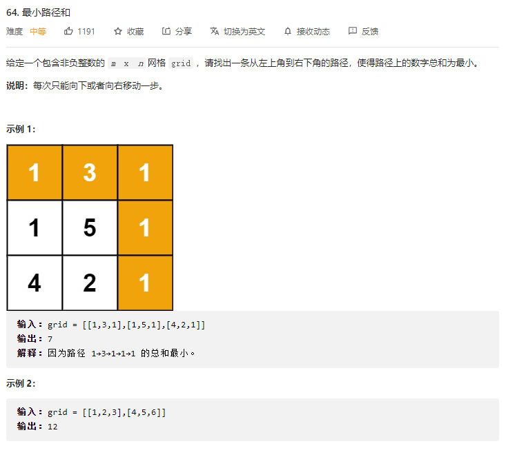

### 64.2 题解

动态规划

+ 由于第一行和第一列只有一种走法，所以先初始化第一行、第一列
+ 由于只能向 右 或 下 走，所以当前格子处的最小值 = Math.min(左边格子的最小值, 上边格子的最小值) + 当前格子的值

```js
var minPathSum = function(grid) {
  const m = grid.length, n = grid[0].length
  const dp = new Array(m).fill().map(() => new Array(n).fill(0))
  dp[0][0] = grid[0][0]
  // 第一列
  for(let i = 1; i < m; i++) {
    dp[i][0] = dp[i - 1][0] + grid[i][0]
  }
  // 第一行
  for(let i = 1; i < n; i++) {
    dp[0][i] = dp[0][i - 1] + grid[0][i]
  }
  // 由于只能向 右 或 下 走，所以当前格子处的最小值 = Math.min(左边格子的最小值, 上边格子的最小值) + 当前格子的值
  for(let i = 1; i < m; i++) {
    for(let j = 1; j < n; j++) {
      dp[i][j] = Math.min(dp[i - 1][j], dp[i][j - 1]) + grid[i][j]
    }
  }
  return dp[m - 1][n - 1]
};
```

### 64.3 总结

动态规划基本解法


## 70. 爬楼梯

### 70.1 题目

[LeetCode 链接](https://leetcode-cn.com/problems/climbing-stairs/)

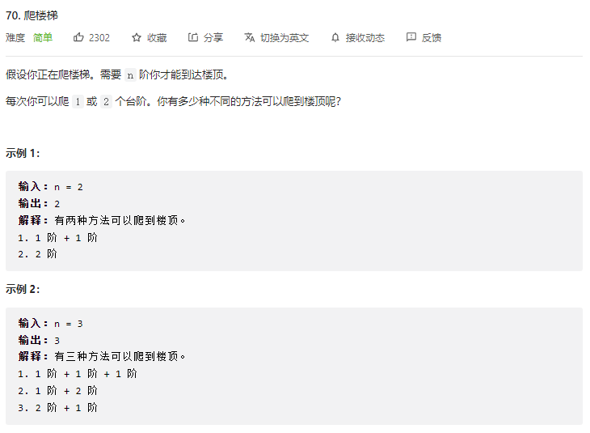

### 70.2 题解

动态规划

+ 由于每次只有 爬 1 或 2 个台阶，所以只有两种情况
+ 第 n 阶的方法数 = 第 n-1 阶的方法数 + 第 n-2 阶的方法数

```js
var climbStairs = function(n) {
  const dp = new Array(n).fill(0)
  dp[0] = 1 // 1阶
  dp[1] = 2 // 2阶
  for(let i = 2; i < n; i++) {
    // 第 i 阶的方法数 = 第 i-1 阶的方法数 + 第 i-2 阶的方法数
    dp[i] = dp[i - 1] + dp[i - 2]
  }
  return dp[n - 1]
};
```

### 70.3 总结

动态规划基本解法


## 72. 编辑距离

### 72.1 题目

[LeetCode 链接](https://leetcode-cn.com/problems/edit-distance/)

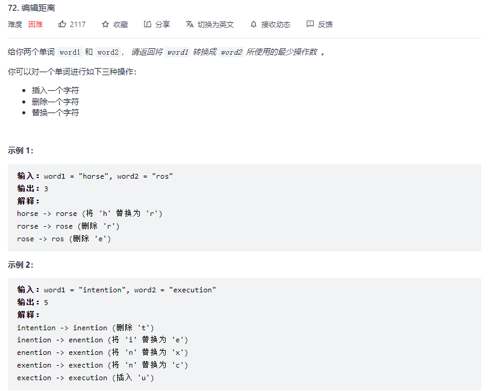

### 72.2 题解

`dp[i][j]` 代表 `word1` 到 `i` 位置转换成 `word2` 到 `j` 位置需要最少步数

所以，当 `word1[i] == word2[j]`，`dp[i][j] = dp[i-1][j-1]`；

当 `word1[i] != word2[j]`，`dp[i][j] = min(dp[i-1][j-1], dp[i-1][j], dp[i][j-1]) + 1`

其中，`dp[i-1][j-1]` 表示替换操作，`dp[i-1`][j] 表示删除操作，`dp[i][j-1] `表示插入操作。

注意，针对第一行，第一列要单独考虑，我们引入`''`下图所示：

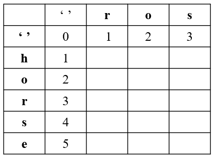

第一行，是 `word1` 为空变成 `word2` 最少步数，就是插入操作

第一列，是 `word2` 为空，需要的最少步数，就是删除操作

```js
var minDistance = function (word1, word2) {
  const m = word1.length,
    n = word2.length
  // dp[i][j] 表示：word1[0...i-1] 变成 woed2[0...j-1] 的最小编辑距离
  const dp = new Array(m + 1).fill().map(() => new Array(n + 1).fill(0))
  for (let i = 1; i <= m; i++) {
    dp[i][0] = i
  }
  for (let j = 1; j <= n; j++) {
    dp[0][j] = j
  }
  // 自底向上求解
  // 插入、删除、替换三种操作
  for (let i = 1; i <= m; i++) {
    for (let j = 1; j <= n; j++) {
      // 相等则啥都不做
      if (word1[i - 1] == word2[j - 1]) {
        dp[i][j] = dp[i - 1][j - 1]
      } else {
        dp[i][j] = Math.min(
          dp[i][j - 1] + 1, // 插入
          dp[i - 1][j] + 1, // 删除
          dp[i - 1][j - 1] + 1 // 替换
        )
      }
    }
  }
  return dp[m][n]
};
```


### 72.3 总结

动态规划，自底向上解决问题。找重叠子问题。


## 75. 颜色分类

### 75.1 题目

[LeetCode 链接](https://leetcode-cn.com/problems/sort-colors/)

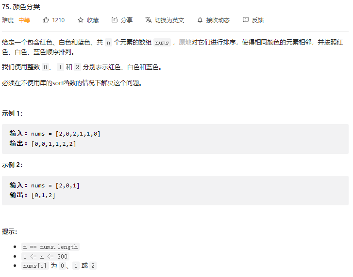

### 75.2 题解

- 双指针, `p1` 前面全是0, `p2` 后面全是2
- 从前往后遍历,将 0 交换到 `p1` 位置, 将 2 交换到 `p2` 位置
- 由于交换 `p2` 后会跳过当前位置，但 `p2` 处的数可能是 0 或 2, 所以需要再检查当前位置(i-- 可以保证下次还在 i 位置)

```js
var sortColors = function(nums) {
  // p1 前面全是0, p2 后面全是2
  let p1 = 0, p2 = nums.length - 1
  // 从前往后遍历,将 0 交换到 p1 位置, 将 2 交换到 p2 位置
  for(let i = 0; i <= p2; i++) {
    if(nums[i] == 0) {
      [nums[p1], nums[i]] = [nums[i], nums[p1]]
      p1++
    } else if(nums[i] == 2) {
      [nums[p2], nums[i]] = [nums[i], nums[p2]]
      p2--
      // p2 处的数可能是0 或 2, 所以需要再检查当前位置
      i--
    }
  }
};
```

### 75.3 总结

注意不要跳过了可能存在的情况


## 76. 最小覆盖子串

### 76.1 题目

[LeetCode 链接](https://leetcode-cn.com/problems/minimum-window-substring/)

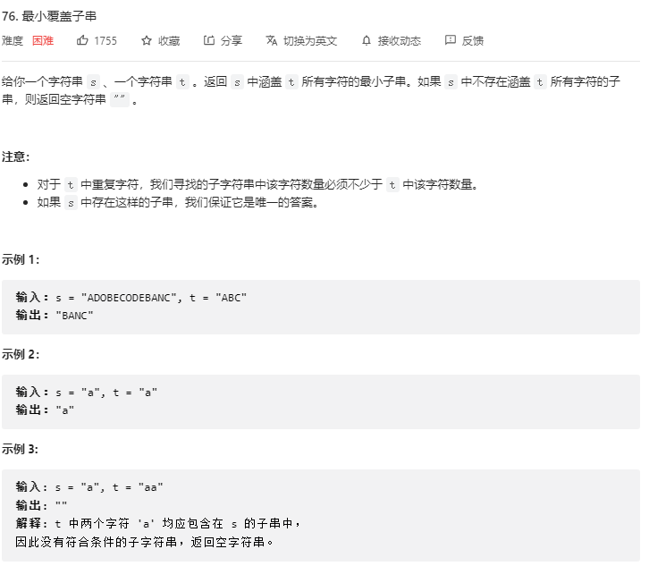

### 76.2 题解

**移动窗口**

+ 我们在字符串 S 中使用双指针中的左右指针技巧，初始化 left = right = 0，把索引闭区间 [left, right] 称为一个「窗口」。
+ 我们先不断地增加 right 指针扩大窗口 [left, right]，直到窗口中的字符串符合要求（包含了 t 中的所有字符）
+ 我们停止增加 right，转而不断增加 left 指针缩小窗口 [left, right]，直到窗口中的字符串不再符合要求（不包含 T 中的所有字符了）。同时，每次增加 left，我们都要更新一轮结果
+ 重复第 2 和第 3 步，直到 right 到达字符串 S 的尽头

```js
var minWindow = function (s, t) {
  // 需要的
  let need = {}
  // 窗口中的字符
  let window = {}
  // 左右指针
  let left = 0,
    right = 0
  let valid = 0
  // 最小覆盖子串的起始索引及长度
  let start = 0,
    len = Number.MAX_VALUE

  for (let a of t) {
    // 统计需要的字符
    need[a] = (need[a] || 0) + 1
  }
  let needValid = Object.keys(need).length
  while (right < s.length) {
    // 即将移入窗口的字符
    let c = s[right]
    // 右移窗口
    right++
    if (need[c]) {
      // 当前字符在需要的字符中，则更新当前窗口统计
      window[c] = (window[c] || 0) + 1
      if (window[c] == need[c]) {
        // 当前窗口和需要的字符匹配时，验证数量增加1
        valid++
      }
    }
    // 当验证数量与需要的字符个数一致时，就应该收缩窗口了
    while (valid == needValid) {
      // 更新最小覆盖子串
      if (right - left < len) {
        start = left
        len = right - left
      }
      // 即将移出窗口的字符
      let d = s[left]
      // 左移窗口
      left++
      if (need[d]) {
        if (window[d] == need[d]) {
          valid--
        }
        window[d]--
      }
    }
  }
  return len == Number.MAX_VALUE ? "" : s.substr(start, len)
};
```

### 76.3 总结

**解题思路：增加窗口右边界，寻找一个可行解，在找到可行解的情况下增加窗口左边界，优化可行解，找到最优解**

`Object.keys( obj ).length` 获取对象的长度。


## 78. 子集

### 78.1 题目

[LeetCode 链接](https://leetcode-cn.com/problems/subsets/)

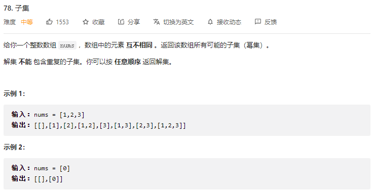

### 78.2 题解

dfs 算法

思路1：考虑每个数字选或者不选

```js
var subsets = function(nums) {
  const path = []
  const res = []
  dfs(0)
  return res

  function dfs(index) {
    if(index === nums.length) {
      res.push(path.slice())
      return
    }

    for(let i = 0; i < 2; i++) {
      // i=0 时，表示包括当前索引为 index 的数字;i=1 时表示不包括
      if(i === 0) {
        dfs(index + 1)
      }
      if(i === 1) {
        path.push(nums[index])
        dfs(index + 1)
        path.pop()
      }
    }
  }
};
```

思路2：在执行子递归之前，加入解集

```js
var subsets = function(nums) {
  const path = []
  const res = []
  dfs(0)
  return res

  function dfs(start) {
    res.push(path.slice())
    // 从 start 开始往后遍历，防止重复
    for(let i = start; i < nums.length; i++) {
      path.push(nums[i])
      dfs(i + 1)
      path.pop()
    }
  }
};
```

### 78.3 总结

子集 用 dfs 算法。


## 79. 单词搜索

### 79.1 题目

[LeetCode 链接](https://leetcode-cn.com/problems/word-search/)


### 79.2 题解

dfs 算法

```js
var exist = function(board, word) {
  const m = board.length
  const n = board[0].length
  const visited = new Array(m).fill().map(() => new Array(n).fill(0))
  // 遍历方向
  const direction = [[0, 1], [0, -1], [-1, 0], [1, 0]]
  // 遍历第一个位置进行查找
  for(let i = 0; i < m; i++) {
    for(let j = 0; j < n; j++) {
      const flag = dfs(i, j, 0)
      // 找到一个位置成功则返回 true
      if(flag) return true
    }
  }
  return false

  function dfs(x, y, index){
    // [x, y] 位置不相等, 返回 false
    if(board[x][y] != word[index]) return false
    // 当全部匹配成功时返回 true
    if(index == word.length - 1) return true
    visited[x][y] = 1

    for(let [dx, dy] of direction) {
      visited[x][y] = 1
      x = x + dx
      y = y + dy
      if(x >= 0 && x < m && y >= 0 && y < n && !visited[x][y]) {
        const flag = dfs(x, y, index + 1)
        if(flag) return true
      }
      x = x - dx
      y = y - dy
      visited[x][y] = 0
    }
  }
};
```

### 79.3 总结

```js
      if(x >= 0 && x < m && y >= 0 && y < n && !visited[x][y]) {
        const flag = dfs(x, y, index + 1)
        if(flag) return true
      }
```

通过 flag 保存当此的结果，如果 成功匹配 直接返回 true


## 84. 柱状图中最大的矩形

### 84.1 题目

[LeetCode 链接](https://leetcode-cn.com/problems/largest-rectangle-in-histogram/)

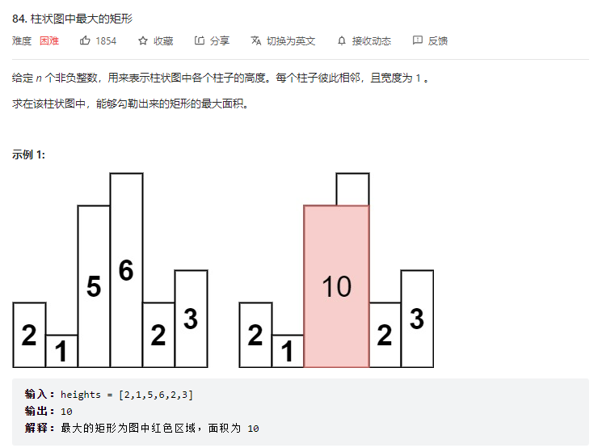

### 84.2 题解

思路：准备单调递增栈存放数组下标，因为这样可以从栈顶找到左边第一个比自己小的下标，这样从当前下标出发到第一个比自己小的柱子的下标就是矩形面积的宽度，然后在乘当前柱子的高度就是面积，如果当前柱子大于栈顶的下标对应的柱子高度，就入栈，否则不断出栈，计算栈顶的柱子所能形成的矩形面积，然后更新最大矩形面积

```js
const largestRectangleArea = (heights) => {
    let maxArea = 0
    const stack = [] //单调递增栈 注意栈存的时下标
    heights = [0, ...heights, 0]    //在heights数组前后增加两个哨兵 用来清零单调递增栈里的元素   
    for (let i = 0; i < heights.length; i++) {
        //当前元素对应的高度小于栈顶元素对应的高度时
        while (heights[i] < heights[stack[stack.length - 1]]) {
            const stackTopIndex = stack.pop() //出栈
            maxArea = Math.max(               //计算面积 并更新最大面积
                maxArea,
                heights[stackTopIndex] * (i - stack[stack.length - 1] - 1)//高乘宽
            )
        }
        stack.push(i)//当前下标加入栈
    }
    return maxArea
}
```

### 84.3 总结

https://leetcode-cn.com/problems/largest-rectangle-in-histogram/solution/84-zhu-zhuang-tu-zhong-zui-da-de-ju-xing-r15e/


## 94. 二叉树的中序遍历

### 94.1 题目

[LeetCode 链接](https://leetcode-cn.com/problems/binary-tree-inorder-traversal/)

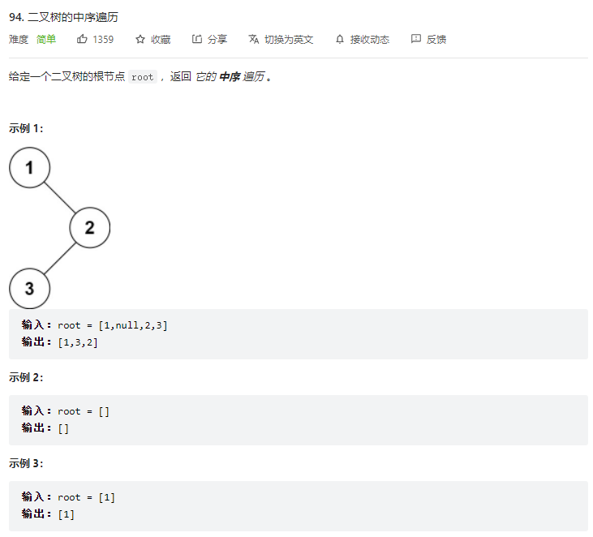

### 94.2 题解

```js
var inorderTraversal = function(root) {
  const res = []
  traverse(root)
  return res

  // 中序遍历（左 -> 根 -> 右）
  function traverse(node) {
    if(!node) return
    traverse(node.left)
    res.push(node.val)
    traverse(node.right)
  }
};
```

### 94.3 总结

二叉树遍历：

+ 先序遍历： (根 -> 左 -> 右)
+ 中序遍历： (左 -> 根 -> 右)
+ 后序遍历： (左 -> 右 -> 根)

https://wjy00.top/computer/sa/#_7-%E6%A0%91


## 1. 标题

### 1.1 题目

[LeetCode 链接]()


### 1.2 题解


```js

```

### 1.3 总结


## 322. 零钱兑换

### 322.1 题目

[LeetCode 链接](https://leetcode-cn.com/problems/coin-change/)

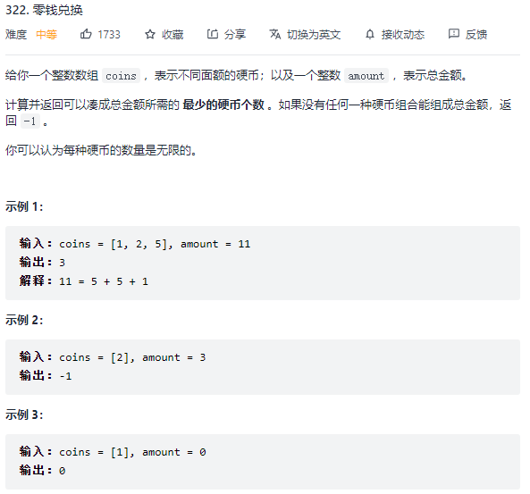

### 322.2 题解

用 `dp数组` 保存：凑出金额i，至少需要dp[i]枚硬币。

`dp[i]` 可以通过 `dp[i - coin] + 1` 得出，比较得到最小值。

最终通过判断 `dp[amount]` 是否为初始值来判断是否可以凑出。

```js
var coinChange = function(coins, amount) {
  // dp数组的定义：凑出金额i，至少需要dp[i]枚硬币
  // 由于是求最小值，所以dp数组填一个比最大值还大的数
  const dp = new Array(amount + 1).fill(amount + 1)
  dp[0] = 0
  for(let i = 1; i < dp.length; i++) {
    for(let coin of coins) {
      // 子问题误解，跳过
      if(i - coin < 0) continue
      // 比较并保存不同凑法的最小值
      dp[i] = Math.min(dp[i], dp[i - coin] + 1)
    }
  }
  // 若 dp[amount] 还为初始值，表明无法凑出
  return dp[amount] === amount + 1 ? -1 : dp[amount] 
};
```


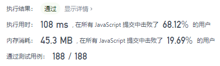

### 322.3 总结

动态规划问题，**自底向上**，穷举所有的可能，保存当前的最小值，减少计算次数。

[动态规划解题套路](https://labuladong.gitee.io/algo/1/4/)

