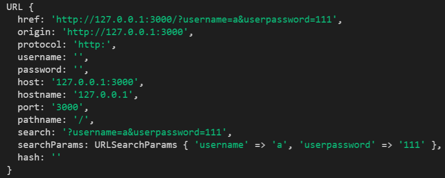

# 二、插件及方法

## 1. 使用mime插件获取文件扩展名 / 设置Content-Type头

### **1.1 安装mime插件**

```js
npm install mime
```

### **1.2 引入并使用mime插件**

```js
// 引入
const mime = require('mime')

// 使用插件获取文件拓展名
mime.getType('1.txt')
mime.getType('.css')
mime.getType('json')
```


## 2. 解析URL的方法

通过`url.parse()` 解析url的方法已废弃，

现通过`URL类`来解析url。

```js
http.createServer((req, res) => {
  // 访问的地址为:http://127.0.0.1:3000/?username=a&userpassword=111
  console.log(req.url);  // '/favicon.ico' '/?username=a&userpassword=111'

  if (req.url !== '/favicon.ico') {
 	// new一个URL实例
    const data = new URL(`${req.url}`, 'http://127.0.0.1:3000/') 
    console.log(data) // data包含的数据如下图
    console.log(data.searchParams); // URL的数据对象
    const name = data.searchParams.get('username') // 通过searchParams的get方法可以获取到想要获取的数据
    const password = data.searchParams.get('userpassword')
    console.log(name, password)
  }

  res.end() // 结束响应
}).listen(3000)

```



