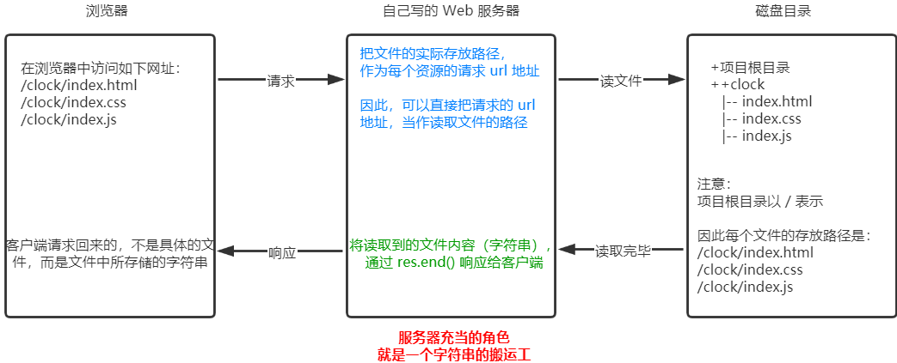

# 三. 创建静态 Web 服务器

## 1. 核心思路

把文件的实际存放路径，作为每个资源的请求 url 地址。



## 2. 实现步骤

① 创建基本的 web 服务器

```
// 导入所需的模块
const http = require('http');
const fs = require('fs');
const path = require('path');

// 创建 web 服务器
http.createServer(function (req, res) {
  res.end('Hello World');
}).listen(80);

console.log('Server running at http://127.0.0.1/');
```

② 将资源的请求 url 地址映射为文件的存放路径

```
// 获取客户端请求的 URL 地址
const url = req.url
// 把请求的 URL 地址映射为具体的文件存放路径
const fpath = path.join(__dirname, url)
```

③ 读取文件的内容并相应给客户端

```
// 根据映射的文件路径读取文件内容，并响应给客户端
fs.readFile(fpath, 'utf-8', (err, data) => {
  // 若读取失败，向客户端响应"错误信息"
  if (err) res.end('404 Not found')
  // 若读取成功，向客户端响应读取的内容
  res.end(data)
})
```

④ 优化资源的请求路径

优化前需要访问/clock/index.html 才可以访问页面，优化后访问路径为 index.html 即可访问页面。

```
// 手动指定文件存放的路径
const fpath = (url === '/') ? path.join(__dirname, './clock/index.html') : path.join(__dirname, './clock', url)

```

## 3. 整体代码

```
// 1.1 导入所需的模块
const http = require('http');
const fs = require('fs');
const path = require('path');

// 1.2 创建 web 服务器
http.createServer(function (req, res) {
  // 2.1 获取客户端请求的 URL 地址
  const url = req.url
  // // 2.2 把请求的 URL 地址映射为具体的文件存放路径
  // const fpath = path.join(__dirname, url)

  // 4.优化资源的请求路径,手动指定文件存放的路径
  const fpath = (url === '/') ? path.join(__dirname, './clock/index.html') :     path.join(__dirname, './clock', url)

  // 3.1 根据映射的文件路径读取文件内容，并响应给客户端
  fs.readFile(fpath, 'utf-8', (err, data) => {
    // 3.2 若读取失败，向客户端响应"错误信息"
    if (err) res.end('404 Not found')
    // 3.3 若读取成功，向客户端响应读取的内容
    res.end(data)
  })
}).listen(80);

console.log('Server running at http://127.0.0.1:80/');
```
