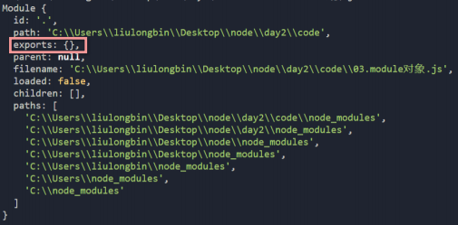
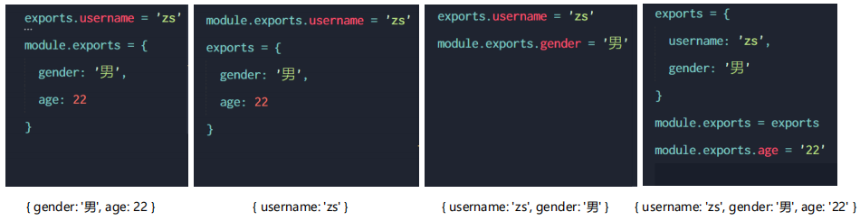

# 四、模块化

## 1. 模块化的基本概念

### 1.1 什么是模块化

**模块化**是指解决一个复杂问题时，自顶向下逐层把系统划分成若干模块的过程。对于整个系统来说，模块是可组合、分解和更换的单元。

编程领域中的模块化，就是**遵守固定的规则**，把一个大文件拆成独立并互相依赖的多个小模块。

> 模块化的好处：
>
> + 提高了代码的复用性
> + 提高了代码的可维护性
> + 可以实现按需加载

### 1.2 模块化规范

**模块化规范**就是对代码进行模块化的拆分与组合时，需要遵守的那些规则。

例如：

+ 使用什么样的语法格式来引用模块

+ 在模块中使用什么样的语法格式向外暴露成员

> 模块化规范的好处：
>
> 大家都遵守同样的模块化规范写代码，降低了沟通的成本，极大方便了各个模块之间的相互调用，利人利己。


## 2. Node.js中的模块化

### 2.1 Node.js 中模块的分类

Node.js 中根据模块来源的不同，将模块分为了 3 大类，分别是：

+ 内置模块（内置模块是由 Node.js 官方提供的，例如 fs、path、http 等）
+ 自定义模块（用户创建的每个 .js 文件，都是自定义模块）
+ 第三方模块（由第三方开发出来的模块，并非官方提供的内置模块，也不是用户创建的自定义模块，使用前需要先下载）

### 2.2 加载模块

使用 `require()` 方法，可以加载需要的内置模块、用户自定义模块、第三方模块进行使用。

```
// 1. 加载内置模块 fs
const fs = require('fs')
// 2. 加载自定义模块 custom
const custom = require('./custom')
// 3. 加载第三方模块
const moment = require('moment')
```

> 注意：使用 require() 方法加载其它模块时，会执行被加载模块中的代码。

### 2.3 Node.js中模块作用域

和函数作用域类似，在自定义模块中定义的变量、方法等成员，只能在当前模块内被访问，这种模块级别的访问限制，叫做**模块作用域**。

> 模块作用域的好处: 防止了全局变量污染的问题

### 2.4 向外共享模块作用域中的成员

1. **module 对象**

   在每个 .js 自定义模块中都有一个 module 对象，它里面存储了和当前模块有关的信息，打印如下：

   

2. **module.exports 对象**

   在自定义模块中，可以使用 **`module.exports`** 对象，将模块内的成员共享出去，供外界使用。

   外界用 require() 方法导入自定义模块时，得到的就是 module.exports 所指向的对象。

   > 在一个自定义模块中，默认情况下， module.exports = {}

   ```
   // 向 module.exports 对象上挂载 username 属性
   module.exports.username = 'zs'
   // 向 module.exports 对象上挂载 sayHello 方法
   module.exports.sayHello = function() {
     console.log('He]llo!')
   }
   // 向 module.exports 对象上挂载 age 属性
   const age = 20
   module.exports.age = age
   
   // 让 module.exports 指向一个全新的对象
   module.exports = {
     nickname: '小黑',
     sayHi() {
       console.log('Hi!')
     }
   }
   ```

3. **共享成员时的注意点**

   使用` require()` 方法导入模块时，导入的结果，**永远以 `module.exports` 指向的对象为准**。

4. **exports 对象**

   由于 `module.exports `单词写起来比较复杂，为了简化向外共享成员的代码，Node 提供了 **`exports`** 对象。

   默认情况下，`exports`和`module.exports` 指向同一个对象。

   最终共享的结果，还是以 **`module.exports`** 指向的对象为准。

   ```
   const username = 'aa'
   
   exports.username = username
   exports.age = 20
   exports.sayHello = function() {
     console.log('大家好！')
   }
   ```

5. **exports 和 module.exports 的使用误区**

   `require() `模块时，得到的永远是 `module.exports` 指向的对象：

   

   > 注意：为了防止混乱，建议不要在同一个模块中同时使用 exports 和 module.exports

### 2.5 Node.js 中的模块化规范

Node.js 遵循了 **CommonJS 模块化规范**，CommonJS 规定了**模块的特性**和**各模块之间如何相互依赖**。

CommonJS 规定：

+ 每个模块内部，**module 变量**代表当前模块。

+ module 变量是一个对象，它的 exports 属性（即 **module.exports**）是**对外的接口**。 
+ 加载某个模块，其实是加载该模块的 module.exports 属性。**require() 方法用于加载模块**。
