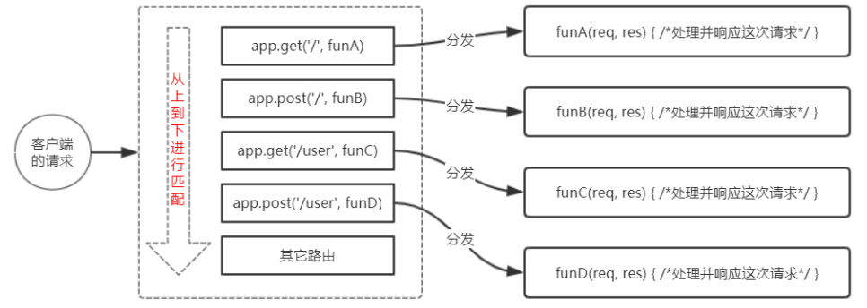
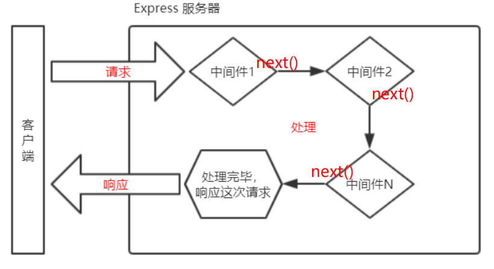
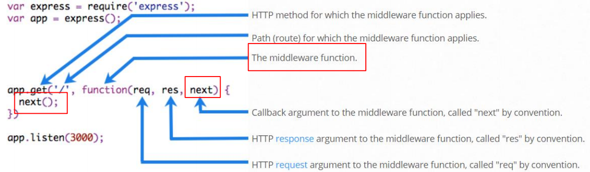
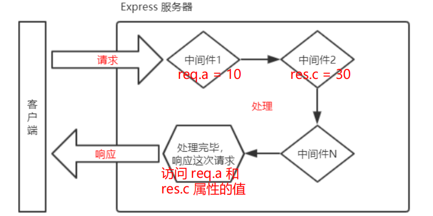
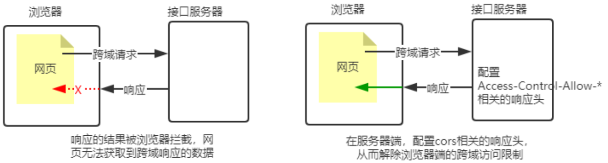

# 五、Express

## 1. Express 简介

### 1.1 什么是 Express

[**Express**](https://www.expressjs.com.cn/) 是基于 Node.js 平台，快速、开放、极简的 Web 开发框架。

**通俗的理解**：Express 的作用和 Node.js 内置的 http 模块类似，是专门用来创建 Web 服务器的。

**本质**：就是一个 npm 上的第三方包，提供了快速创建 Web 服务器的便捷方法。

### 1.2 Express 能做什么

对于前端程序员来说，最常见的**两种**服务器，分别是：

+ **Web 网站服务器**：专门对外提供 Web 网页资源的服务器。
+ **API 接口服务器**：专门对外提供 API 接口的服务器。

使用 Express，我们可以方便、快速的创建 Web 网站的服务器或 API 接口的服务器。


## 2. Express的基本使用

### 2.1 安装

在项目目录中，输入以下终端命令：

```
npm i express
```

### 2.2 创建基本的 Web 服务器

```js
// 1. 导入express
const express = require('express')
// 2. 创建 web 服务器
const app = express()
// 3. 启动 web 服务器
app.listen(80, () => {
  console.log('express server running at http://127.0.0.1');
})
```

可以使用 `node-snippets` 插件快速创建，输入 `nodeexpress` 即可。

```js
const express = require('express')
const app = express()
const port = 3000

app.get('/', (req, res) => res.send('Hello World!'))
app.listen(port, () => console.log(`Example app listening on port ${port}!`))
```

### 2.3 监听 GET 请求

通过 `app.get()` 方法，可以监听客户端的 GET 请求，具体的语法格式如下：

```js
app.get('请求URL', (req, res) => { /*处理函数*/ })
```

+ 参数1：客户端请求的URL地址
+ 参数2：请求对应的处理函数   req：请求对象   res：响应对象

### 2.4 监听 POST 请求

通过 `app.post()` 方法，可以监听客户端的 POST 请求，具体的语法格式如下：

```js
app.post('请求URL', (req, res) => { /*处理函数*/ })
```

### 2.5 把内容响应给客户端

通过 `res.send()` 方法，可以把处理好的内容，发送给客户端：

```js
app.get('/user', (req, res) => {
  // 向客户端发送JSON对象
  res.send({name: 'ZhangSan', age: 20})
})

app.post('/user', (req, res) => {
  // 向客户端发送文本信息
  res.send('请求成功')
})
```

### 2.6 获取 URL 中携带的查询参数

通过 **`req.query`** 对象，可以访问到客户端通过**查询字符串**的形式，发送到服务器的参数：

```js
app.get('/', (req, res) => {
  // req.query 默认是一个空对象
  // 客户端使用 ?name=za&age=20 这种查询字符串形式，发送到服务器的参数，可以通过 req.query 对象访问到，例如：
  // req.query.name   req.query.age
  console.log(req.query)
})
```

### 2.7 获取 URL 中的动态参数

通过 **`req.params`** 对象，可以访问到 URL 中，通过 `:参数名`匹配**动态参数**：

```js
// URL 地址中，可以通过 :参数名 的形式，匹配动态参数值
app.get('/user/:id', (req, res) => {
  // req.params 默认是一个空对象
  // 里面存放着通过 : 动态匹配到的参数值
  console.log(req.params)
})
```


## 3. 托管静态资源

### 3.1 express.static()

express 提供了一个非常好用的函数，叫做 **`express.static()`**，通过它，我们可以非常方便地创建一个静态资源服务器，例如，通过如下代码就可以将 public 目录下的图片、CSS 文件、JavaScript 文件对外开放访问了：

```js
app.use(express.static('public'))
```

就可以访问 public 目录中的所有文件了：

+ http://localhost:3000/images/bg.jpg
+ http://localhost:3000/css/style.css
+ http://localhost:3000/js/login.js

**注意：**Express 在指定的静态目录中查找文件，并对外提供资源的访问路径。因此，存放静态文件的目录名不会出现在 URL 中。

### 3.2 托管多个静态资源目录

如果要托管多个静态资源目录，需要多次调用 express.static() 函数

```js
app.use(express.static('public'))
app.use(express.static('files'))
```

访问静态资源文件时，express.static() 函数会根据目录的添加顺序查找所需的文件。

### 3.3 挂载路径前缀

如果希望在托管的静态资源访问路径之前，**挂载路径前缀**，则可以使用如下的方式：

```js
app.use('/public', express.static('public'))
```

就可以通过带有 `/public` 前缀地址来访问 public 目录中的文件了：

+ http://localhost:3000/public/images/bg.jpg
+ http://localhost:3000/public/css/style.css
+ http://localhost:3000/public/js/login.js


## 4. Express 路由

### 4.1 Express 中的路由

在 Express 中，路由指的是**客户端的请求**与**服务器处理函数**之间的映射关系。

Express 中的路由分 3 部分组成，分别是**请求的类型**`(METHOD)`、**请求的 URL 地址**`(PATH)`、**处理函数**`(HANDLER)`，格式如下：

```js
app.METHOD(PATH, HANDLER)
```

### 4.2 路由的匹配过程

每当一个请求到达服务器之后，需要**先经过路由的匹配**，只有匹配成功之后，才会调用对应的处理函数。

在匹配时，会按照路由的顺序进行匹配，如果**请求类型**和**请求的 URL** 同时匹配成功，则 Express 会将这次请求，转交给对应的 function 函数进行处理。



注意点：

+ 按照定义的先后顺序进行匹配
+ 请求类型和请求的URL同时匹配成功，才会调用对应的处理函数

### 4.3 模块化路由

为了方便对路由进行模块化的管理，Express **不建议**将路由直接挂载到 app 上，而是推荐将路由抽离为单独的模块。

将路由抽离为单独模块的步骤如下：

+ 创建路由模块对应的 .js 文件
+ 调用 `express.Router()` 函数创建路由对象
+ 向路由对象上挂载具体的路由
+ 使用 `module.exports` 向外共享路由对象
+ 使用 `app.use()` 函数注册路由模块

1. 创建路由模块

   ```js
   // 1. 引入express模块
   const express = require('express')
   // 2. 创建路由对象
   const router = express.Router()
   
   // 3. 挂载具体的路由
   router.get('/user/list', (req, res) => {
     res.send('Get user list.')
   })
   router.post('/user/add', (req, res) => {
     res.send('Add new user.')
   })
   
   // 4，向外导出路由对象
   module.exports = router
   ```

2. 注册路由模块

   在 `app.js` 中导入并使用路由模块

   ```js
   // 1. 导入路由模块
   const userRouter = require('./router/user.js')
   
   // 2. 使用 app.use() 注册路由模块
   app.use(userRouter)
   ```

3. 为路由模块添加前缀

   类似于托管静态资源时，为静态资源统一挂载访问前缀一样，路由模块添加前缀的方式：

   ```
   // 1. 导入路由模块
   const userRouter = require('./router/user.js')
   
   // 2. 使用 app.use() 注册路由模块，并添加统一的访问前缀 /api
   app.use('/api', userRouter)
   ```


## 5. Express 中间件

> 中间件（Middleware），特指业务流程的中间处理环节。

### 5.1 中间件的调用流程

当一个请求到达 Express 的服务器之后，可以连续调用多个中间件，从而对这次请求进行预处理。



### 5.2  中间件的格式

Express 的中间件，本质上就是一个 **function 处理函数**，Express 中间件的格式如下：



注意：中间件函数的形参列表中，**必须包含** **next 参数**。而路由处理函数中只包含 req 和 res。

> **next 函数**是实现多个中间件连续调用的关键，它表示把流转关系转交给下一个中间件或路由。

### 5.3 中间件的使用

#### ① 定义中间件函数

通过如下的方式，定义一个最简单的中间件函数：

``` js
const mw = function(req, res, next) {
  console.log('一个最简单的中间件函数')
  // 注意：在当前中间件的业务处理完毕后，必须调用 next() 函数
  // 表示把当前流转关系转交给下一个中间件或路由
  next()
}
```

#### ② **全局生效**的中间件

客户端发起的任何请求，到达服务器之后，都会触发的中间件，叫做全局生效的中间件。

通过调用 `app.use(中间件函数)`，即可定义一个全局生效的中间件，示例代码如下：

```js
const mw = function(req, res, next) {
  console.log('一个最简单的中间件函数')
  next()
}

app.use(mw)
```

简化形式：

```js
app.use((req, res, next) => {
  console.log('一个最简单的中间件函数')
  next()
})
```

#### ③ 中间件的作用

多个中间件之间，**共享同一份** **req** **和** **res**。

基于这样的特性，<u>我们可以在上游的中间件中，统一为 req 或 res 对象添加自定义的属性或方法</u>，供下游的中间件或路由进行使用。



#### ④ 定义多个全局中间件

可以使用 app.use() 连续定义多个全局中间件。客户端请求到达服务器之后，会按照中间件定义的先后顺序依次进行调用。

#### ⑤ **局部生效**的中间件

**不使用** app.use() 定义的中间件，叫做局部生效的中间件，示例代码如下：

```js
// 定义中间件函数
const mw1 = function(req, res, next) {
  console.log('这是个中间件函数')
  next()
}

// 局部使用的中间件
app.get('/', mw1, function(req, res) {
  res.send('Home Page.')
})
```

#### ⑥ 定义多个局部中间件

可以在路由中，通过如下两种等价的方式，使用多个局部中间件：（从前往后）

```js
app.get('/', mw1, mw2, (req, res) => { res.send('Home Page.') })
app.get('/', [mw1, mw2], (req, res) => { res.send('Home Page.') })
```

#### ⑦ 中间件的注意事项

+ 一定要在**路由之前**注册中间件
+ 客户端发送过来的请求，可以连续调用多个中间件进行处理
+ 执行完中间件的业务代码之后，**不要忘记调用 next() 函数**
+ 为了防止代码逻辑混乱，调用 next() 函数后不要再写额外的代码
+ 连续调用多个中间件时，多个中间件之间，**共享 req 和 res 对象**

### 5.4 中间件的分类

Express 官方把常见的中间件用法，分成了 5 大类，分别是：

+ 应用级别的中间件
+ 路由级别的中间件
+ 错误级别的中间件
+ Express 内置的中间件
+ 第三方的中间件

1. **应用级别的中间件**

   通过 `app.use()` 或 `app.get()` 或 `app.post()` ，绑定到 app 实例上的中间件，叫做应用级别的中间件

2. **路由级别的中间件**

   绑定到 express.Router() 实例上的中间件，叫做路由级别的中间件。它的用法和应用级别中间件没有任何区别。

   只不过，应用级别中间件是绑定到 **app实例**上，路由级别中间件绑定到 **router实例**上。

3. **错误级别的中间件**

   错误级别中间件的**作用**：专门用来捕获整个项目中发生的异常错误，从而防止项目异常崩溃的问题。

   **格式**：错误级别中间件的 function 处理函数中，必须有 4 个形参，形参顺序从前到后，分别是 (**err**, req, res, next)。

   ``` js
   app.get('/', (req, res) => {
     throw new Error('服务器内部发生了错误！')
     res.send('Home Page.')
   })
   // 定义错误级别的中间件，捕获整个项目的异常错误，从而防止程序崩溃
   app.use((err, req, res, next) => {
     console.log('发送了错误：' + err.message)
     res.send('Error:' + err.message)
   })
   ```

   > **注意：**错误级别的中间件，必须注册在所有路由之后！

4. **Express 内置的中间件**

   自 Express 4.16.0 版本开始，Express 内置了 3 个常用的中间件，极大的提高了 Express 项目的开发效率和体验：

   + **`express.static`** 快速托管静态资源的内置中间件，例如： HTML 文件、图片、CSS 样式等（无兼容性）

   + **`express.json`** 解析 <u>JSON 格式</u>的请求体数据（有兼容性，仅在 4.16.0+ 版本中可用）

     ```
     app.use(express.json())
     ```

   + **`express.urlencoded`** 解析 <u>URL-encoded 格式</u>的请求体数据（有兼容性，仅在 4.16.0+ 版本中可用）

     ```
     app.use(express.urlencoded({ extended: false }))
     ```

   > 使用 **`req.body`** 来获取 JSON 格式和 url-encoded 格式的数据，如果没有配置任何解析表单数据的中间件，则 req.body 默认等于 `undefined`

5. **第三方的中间件**

   非 Express 官方内置的，而是由第三方开发出来的中间件，叫做第三方中间件。

   例如：在 express@4.16.0 之前的版本中，经常使用 body-parser 这个第三方中间件，来解析请求体数据。使用步骤如下：

   + 运行 npm install body-parser 安装中间件
   + 使用 require 导入中间件
   + 调用 app.use() 注册并使用中间件

   **注意：**Express 内置的 express.urlencoded 中间件，就是基于 body-parser 这个第三方中间件进一步封装出来的。

### 5.5 自定义中间件

1. 需求描述与实现步骤

   手动模拟一个类似于 `express.urlencoded` 这样的中间件，来解析 POST 提交到服务器的表单数据。

   实现步骤：

   + 定义中间件
   + 监听 req 的 data 事件
   + 监听 req 的 end 事件
   + 使用 querystring 模块解析请求体数据
   + 将解析出来的数据对象挂载为 req.body
   + 将自定义中间件封装为模块

2. 定义中间件

   使用 app.use() 来定义全局生效的中间件，代码如下：

   ```js
   qpp.use(function(req, res, next) {
     // 中间件的业务逻辑
   })
   ```

3. 监听 req 的 data 事件

   在中间件中，需要监听 req 对象的 **`data 事件`**，来<u>获取客户端发送到服务器的数据</u>。

   如果数据量比较大，无法一次性发送完毕，则客户端会把数据切割后，分批发送到服务器。所以 data 事件可能会触发多次，每一次触发 data 事件时，获取到数据只是完整数据的一部分，需要手动对接收到的数据进行拼接。

   ```js
   // 定义变量，用来储存客户端发送过来的请求体数据
   let str = ''
   // 监听req对象的data事件（客户端发送过来的新的请求体数据）
   req.on('data', (chunk) => {
     // 拼接请求体数据，隐式转换为字符串
     str += chunk
   })
   ```

4. 监听 req 的 end 事件

   当请求体数据接收完毕之后，会自动触发 req 的 **`end 事件`**。

   因此，我们可以在 req 的 end 事件中，拿到并处理完整的请求体数据。示例代码如下：

   ```js
   // 监听req对象的end事件（请求体发送完毕后自动触发）
   req.on('end', () => {
     // 打印完整的请求体数据
     console.log(str)
     // 接下来需要：把字符串格式的请求体数据，解析成对象格式
   })
   ```

5. 使用 querystring 模块解析请求体数据

   Node.js 内置了一个 **`querystring 模块`**，专门<u>用来处理查询字符串</u>。通过这个模块提供的 parse() 函数，可以把查询字符串，解析成对象的格式。示例代码如下：

   ```js
   // 导入querystring模块
   const qs = require('querystring')
   // 调用 qs.parse() 方法，把查询字符串解析为对象
   const body = qs.parse(str)
   ```

6. 将解析出来的数据对象挂载为 req.body

   上游的中间件和下游的中间件及路由之间，**共享同一份 req 和 res**。因此，我们可以将解析出来的数据，挂载为 req 的自定义属性，命名为 req.body，供下游使用。示例代码如下：

   ```js
   req.on('end', () => {
     const body = qs.parse(str)
     req.body = body   // 将解析出来的请求体对象，挂载为 req.body 属性
     next()
   })
   ```

7. 将自定义中间件封装为模块

   为了优化代码的结构，可以把自定义的中间件函数，封装为独立的模块，示例代码如下：

   ```js
   const qs = require('querystring')
   const bodyParaser = (req, res, next) { /* 中间件功能代码 */ }
   module.exports = bodyParaser // 导出中间件函数
   ```

   ```js
   // 1. 导入自定义中间件模块
   const myBodyParaser = require('./body-parser.js')
   // 2. 注册自定义的中间件模块
   app.use(myBodyParser)
   ```


## 6. 使用 Express 写接口

### 6.1 创建基本的服务器

```js
const express = require('express')
const app = express()
const port = 3000

app.listen(port, () => console.log(`Example app listening on port ${port}!`))
```

### 6.2 创建 API 路由模块

路由模块(apiRouter.js):

```js
const express = require('express')
const apiRouter = express.Router()

/* 
  模块功能代码:
  GET接口、POST接口等等
*/

module.exports = apiRouter
```

app.js 中导入并注册路由模块:

```js
const apiRouter = require('./apiRouter.js')
app.use('/api', apiRouter)
```

### 6.3 编写 GET 接口

通过**查询字符串**请求数据，`req.query`

```js
apiRouter.get('/get', (req, res) => {
  // 获取客户端通过查询字符串，发送到服务器的数据
  const query = req.query
  // 把数据响应给客户端
  res.send({
    status: 0,              // 状态码
    msg: 'GET请求成功！',    // 状态描述
    data: query             // 需要响应给客户端的具体数据
  })
})
```

### 6.4 编写 POST 接口

通过**请求体**请求数据，`req.body`

```js
app.use(express.urlencoded({ extended: false }))

apiRouter.get('/get', (req, res) => {
  // 获取客户端通过请求体，发送到服务器的 URL-encoded 数据
  const body = req.body
  // 把数据响应给客户端
  res.send({
    status: 0,              // 状态码
    msg: 'POST请求成功！',    // 状态描述
    data: body             // 需要响应给客户端的具体数据
  })
})
```

注意：如果要获取 **`URL-encoded` 格式**的请求体数据，必须配置中间件 `app.use(express.urlencoded({ extended: false }))`

### 6.5 CORS 跨域资源共享

1. 接口的跨域问题

   我们通常所说的跨域是由浏览器**同源策略限制**的一类请求场景。

   > 同源策略/SOP（Same origin policy）是一种约定，由Netscape公司1995年引入浏览器，它是浏览器最核心也最基本的安全功能，如果缺少了同源策略，浏览器很容易受到XSS、CSFR等攻击。所谓同源是指"协议+域名+端口"三者相同，即便两个不同的域名指向同一个ip地址，也非同源。

   解决方案主要有两种:

   + CORS（主流的解决方案，推荐使用） 
   + JSONP（有缺陷的解决方案：只支持 GET 请求）

2. 使用 **cors 中间件**解决跨域问题

   cors 是 Express 的一个第三方中间件。通过安装和配置 cors 中间件，可以很方便地解决跨域问题。

   使用步骤：

   + 运行 `npm install cors` 安装中间件
   + 使用 `const cors = require('cors')` 导入中间件
   + 在**路由之前**调用 `app.use(cors())` 配置中间件

3. 什么是 CORS

   CORS （Cross-Origin Resource Sharing，跨域资源共享）由一系列 HTTP 响应头组成，**这些 HTTP 响应头决定浏览器是否阻止前端 JS 代码跨域获取资源**。

   浏览器的**同源安全策略**默认会阻止网页“跨域”获取资源。但如果接口服务器配置了 CORS 相关的 **HTTP 响应头**，就可以解除浏览器端的跨域访问限制。

   

4. CORS 的注意事项

   + CORS 主要在**服务器端**进行配置。客户端浏览器**无须做任何额外的配置**，即可请求开启了 CORS 的接口。
   + CORS 在浏览器中有兼容性。只有支持 XMLHttpRequest Level2 的浏览器，才能正常访问开启了 CORS 的服务端接口（例如：IE10+、Chrome4+、FireFox3.5+）。

5. CORS 配置的响应头

   **①  Access-Control-Allow-Origin**

   响应头部中可以携带一个 **Access-Control-Allow-Origin** 字段，其语法如下:

   ```js
   Access-Control-Allow-Origin: <origin> | *
   ```

   其中，origin 参数的值指定了允许访问该资源的外域 URL。

   例如，下面的字段值将**只允许**来自 http://baidu.com 的请求：

   ```js
   res.sertHeader('Access-Control-Allow-Origin', 'http://baidu.com')
   ```

   如果指定了 Access-Control-Allow-Origin 字段的值为通配符 *****，表示允许来自任何域的请求：

   ```js
   res.sertHeader('Access-Control-Allow-Origin', '*')
   ```

   **② Access-Control-Allow-Headers**

   默认情况下，CORS **仅**支持客户端向服务器发送如下的 9 个请求头：

   Accept、Accept-Language、Content-Language、DPR、Downlink、Save-Data、Viewport-Width、Width 、Content-Type （值仅限于 text/plain、multipart/form-data、application/x-www-form-urlencoded 三者之一）

   如果客户端向服务器发送了额外的请求头信息，则需要在服务器端，通过 Access-Control-Allow-Headers 对额外的请求头进行声明，否则这次请求会失败！

   **③ Access-Control-Allow-Methods**

   默认情况下，CORS 仅支持客户端发起 <u>GET、POST、HEAD</u> 请求。

   如果客户端希望通过 <u>**PUT、DELETE**</u> 等方式请求服务器的资源，则需要在服务器端，通过 Access-Control-Alow-Methods来指明实际请求所允许使用的 HTTP 方法。

   ```js
   // 只允许 POST、GET、DELETE、HEAD 请求方法
   res.setHeader('Access-Control-Allow-Methods', 'POST, GET, DELETE, HEAD')
   // 允许所有的HTTP请求方法
   res.setHeader('Access-Control-Allow-Methods', '*')
   ```

6. CORS请求的分类

   客户端在请求 CORS 接口时，根据请求方式和请求头的不同，可以将 CORS 的请求分为两大类，分别是：简单请求和预检请求。

   **① 简单请求**

   同时满足以下两大条件的请求，就属于简单请求：

   + <u>请求方式</u>：GET、POST、HEAD 三者之一
   + <u>HTTP 头部信息</u>不超过以下几种字段：无自定义头部字段、Accept、Accept-Language、Content-Language、DPR、Downlink、Save-Data、Viewport-Width、Width 、Content-Type（只有三个值application/x-www-form-urlencoded、multipart/form-data、text/plain）

   **② 预检请求**

   只要符合以下任何一个条件的请求，都需要进行预检请求：

   + 请求方式为 GET、POST、HEAD **之外**的请求 Method 类型
   + 请求头中包含自定义头部字段
   + 向服务器发送了 <u>application/json</u> 格式的数据

   在浏览器与服务器正式通信之前，浏览器会<u>先发送 OPTION 请求进行预检</u>，以获知服务器是否允许该实际请求，所以这一次的 OPTION 请求称为“预检请求”。服务器成功响应预检请求后，才会发送真正的请求，并且携带真实数据。

   **③ 简单请求和预检请求的区别**

   **简单请求的特点**：客户端与服务器之间只会发生一次请求。

   **预检请求的特点**：客户端与服务器之间会发生两次请求，OPTION 预检请求成功之后，才会发起真正的请求。