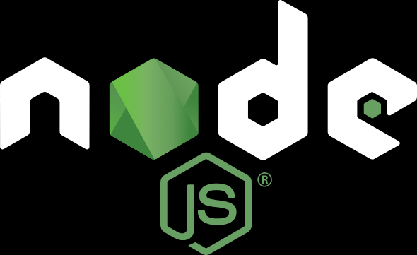

# Node.js

[Node.js](http://nodejs.cn/api/) 是一个基于 `Chrome V8 引擎`的 JavaScript 运行环境。

> 浏览器是 JavaScript 的前端运行环境;
>
> Node.js 是 JavaScript 的后端运行环境; 
>
> Node.js 中无法调用 DOM 和 BOM 等浏览器内置 API。

Node.js作为一个 JavaScript 的运行环境，仅仅提供了基础的功能和 API。然而，基于 Node.js 提供的这些基础能，很多强大的工具和框架出现了,使用这些工具和框架可以实现很多功能。

* 基于 [Express 框架](http://www.expressjs.com.cn/)，可以快速构建 Web 应用。
* 基于 [Electron 框架](https://electronjs.org/)，可以构建跨平台的桌面应用。
* 基于 [restify 框架](http://restify.com/)，可以快速构建 API 接口项目。